Mr. Ngo - `<u>`uit@gm.uit.edu.vn`</u>`

Mr. Dinh - `<u>`uit@gm.uit.edu.vn`</u>`

*Prepared for*

SeShop Project

**Version 1.0**

**SOFTWARE REQUIREMENTS SPECIFICATION**

SeShop

**Revision and Sign Off Sheet**

**Change Record**

|                                |                  |                                              |                |
| :----------------------------: | :---------------: | :------------------------------------------: | :------------: |
|        **Author**        | **Version** |          **Change reference**          | **Date** |
|         Previous Team         |        0.1        |               Legacy baseline               |   05/01/2024   |
| GitHub Copilot (GPT-5.3-Codex) |        0.2        |    Omnichannel scope adaptation from BRD    |   27/03/2026   |
| GitHub Copilot (GPT-5.3-Codex) |        1.0        | Final SRS draft with PlantUML activity flows |   27/03/2026   |

**Reviewers**

|                |                  |                    |                |
| :------------: | :---------------: | :----------------: | :------------: |
| **Name** | **Version** | **Position** | **Date** |
|      TBD      |        1.0        |   Business Owner   |      TBD      |
|      TBD      |        1.0        |  Product Manager  |      TBD      |
|      TBD      |        1.0        |   Technical Lead   |      TBD      |

**Table of Contents**

[**1. Introduction**](#introduction)

> [1.1. Purpose](#purpose)
>
> [1.2. Scope](#scope)
>
> [1.3. Intended Audiences and Document Organization](#intended-audiences-and-document-organization)

[**2. Functional Requirements**](#functional-requirements)

[**2.1. Use Case Description**](#use-case-description)

> [UC1: Create custom role](#uc1-create-custom-role)
>
> [UC2: Assign permission to role](#uc2-assign-permission-to-role)
>
> [UC3: Assign or revoke role for staff](#uc3-assign-or-revoke-role-for-staff)
>
> [UC4: View audit logs](#uc4-view-audit-logs)
>
> [UC5: Add product and SKUs](#uc5-add-product-and-skus)
>
> [UC6: Adjust SKU inventory](#uc6-adjust-sku-inventory)
>
> [UC7: Transfer stock between locations](#uc7-transfer-stock-between-locations)
>
> [UC8: Process POS sale](#uc8-process-pos-sale)
>
> [UC9: Process refund](#uc9-process-refund)
>
> [UC10: Manage discount codes](#uc10-manage-discount-codes)
>
> [UC11: Compose Instagram draft](#uc11-compose-instagram-draft)
>
> [UC12: Register account](#uc12-register-account)
>
> [UC13: Browse and filter variants](#uc13-browse-and-filter-variants)
>
> [UC14: AI recommendation chat](#uc14-ai-recommendation-chat)
>
> [UC15: Checkout and pay](#uc15-checkout-and-pay)
>
> [UC16: View stock by location](#uc16-view-stock-by-location)
>
> [UC17: Track shipment](#uc17-track-shipment)
>
> [UC18: Leave review with image](#uc18-leave-review-with-image)
>
> [UC19: View pending online orders](#uc19-view-pending-online-orders)
>
> [UC20: Mark order as shipped with tracking](#uc20-mark-order-as-shipped-with-tracking)
>
> [UC21: Connect or reconnect Instagram account](#uc21-connect-or-reconnect-instagram-account)
>
> [UC22: Purchase order and stock receiving](#uc22-purchase-order-and-stock-receiving)
>
> [UC23: Allocate order to fulfillment location](#uc23-allocate-order-to-fulfillment-location)
>
> [UC24: Return intake and exchange](#uc24-return-intake-and-exchange)
>
> [UC25: Cycle count and inventory reconciliation](#uc25-cycle-count-and-inventory-reconciliation)
>
> [UC26: POS shift close and cash reconciliation](#uc26-pos-shift-close-and-cash-reconciliation)
>
> [UC27: Generate tax invoice and adjustment note](#uc27-generate-tax-invoice-and-adjustment-note)

[**2.2. List Description**](#list-description)

[**2.3. View Description**](#view-description)

[**2.4. Requirements Traceability Matrix**](#requirements-traceability-matrix)

[**3. Non-functional Requirements**](#non-functional-requirements)

> [3.1. User Access and Security](#31-user-access-and-security)
>
> [3.2. Performance Requirements](#32-performance-requirements)
>
> [3.3. Implementation Requirements](#33-implementation-requirements)

[**4. Appendixes**](#appendixes)

> [Glossary](#glossary)
>
> [Messages](#messages)
>
> [Issues List](#issues-list)

# Introduction

## **Purpose**

This document is the Software Requirements Specification (SRS) for the SeShop project. It translates approved business requirements into functional and non-functional specifications for engineering, QA, operations, and stakeholder review.

The document is intended to be the baseline for implementation planning, test design, release validation, and acceptance.

## **Scope**

The scope includes a single-business omnichannel clothing and accessories platform with:

- Storefront shopping and account management.
- Multi-location inventory management with `STORE` and `STORAGE` nodes.
- Role-based staff operations and immutable audit logs.
- Order, shipment, POS, and refund workflows.
- Discount management and social compose workflow for Instagram.
- AI recommendation chat integrated with live stock context.

Out of scope for `v1`:

- Multi-vendor marketplace.
- Loyalty points and gift cards.
- Auto-publish to social channels without manual approval.
- BOPIS (Buy Online Pick Up In-Store).

## **Intended Audiences and Document Organization**

This document is intended for:

- Development Team: implement APIs, services, and UI modules based on UC and BR details.
- QA/UAT Team: derive test cases from business rules and acceptance behavior.
- Product/Business Team: validate scope and operation alignment.
- Operations/Security Team: review access matrix, auditability, and service constraints.

Main sections:

- **1. Introduction**: Project goal and scope.
- **2. Functional Requirements**: Use cases, activity flows, and business rules.
- **3. Non-functional Requirements**: Security, performance, and implementation constraints.
- **4. Appendixes**: Glossary, messages, and unresolved items.

# Functional Requirements

# Use Case Description

### UC1: Create custom role

|                          |                                                                                |
| ------------------------ | ------------------------------------------------------------------------------ |
| **Name**           | Create custom role                                                             |
| **Description**    | Super Admin creates a role for single-function or grouped-function operations. |
| **Actor**          | Super Admin                                                                    |
| **Trigger**        | Clicks `Access Management > Create Role`.                                    |
| **Pre-condition**  | Super Admin is authenticated and authorized.                                   |
| **Post-condition** | New role is created and audit log is written.                                  |

#### Activities Flow

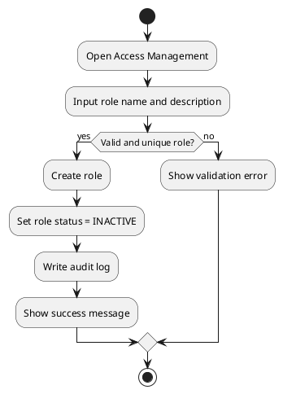

#### Business Rules

| Activity       | BR Code | Description                                                               |
| -------------- | ------- | ------------------------------------------------------------------------- |
| Validate input | BR1     | `roleName` is required and unique.                                      |
| Create role    | BR2     | Role starts as `INACTIVE` until at least one permission is assigned.    |
| Audit          | BR3     | System records actor, action, target role ID, timestamp, and IP metadata. |

### UC2: Assign permission to role

|                          |                                                       |
| ------------------------ | ----------------------------------------------------- |
| **Name**           | Assign permission to role                             |
| **Description**    | Super Admin maps atomic permissions to a custom role. |
| **Actor**          | Super Admin                                           |
| **Trigger**        | Clicks `Role Detail > Assign Permission`.           |
| **Pre-condition**  | Role exists. Permission catalog exists.               |
| **Post-condition** | Role permission set is updated and logged.            |

#### Activities Flow

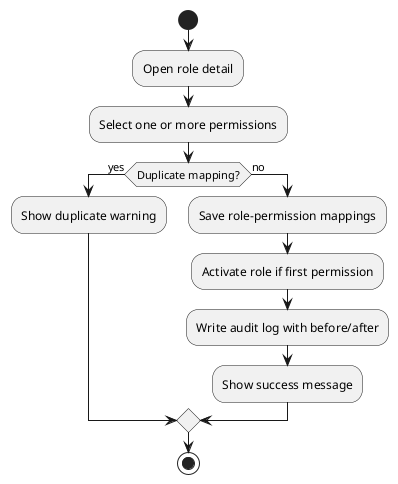

#### Business Rules

| Activity         | BR Code | Description                                                            |
| ---------------- | ------- | ---------------------------------------------------------------------- |
| Validate mapping | BR4     | Duplicate `role-permission` entries are not allowed.                 |
| Update status    | BR5     | Role can transition to `ACTIVE` when at least one permission exists. |
| Propagation      | BR6     | Permission change is effective within configured SLA.                  |

### UC3: Assign or revoke role for staff

|                          |                                                          |
| ------------------------ | -------------------------------------------------------- |
| **Name**           | Assign or revoke role for staff                          |
| **Description**    | Super Admin manages role assignment lifecycle for staff. |
| **Actor**          | Super Admin                                              |
| **Trigger**        | Clicks `Staff Detail > Manage Roles`.                  |
| **Pre-condition**  | Staff account exists and is active.                      |
| **Post-condition** | Staff effective permissions are updated and logged.      |

#### Activities Flow

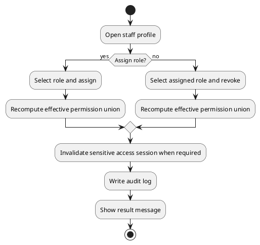

#### Business Rules

| Activity     | BR Code | Description                                                                       |
| ------------ | ------- | --------------------------------------------------------------------------------- |
| Assignment   | BR7     | Only active roles can be assigned.                                                |
| Revocation   | BR8     | Critical permission revocation is effective immediately.                          |
| Access model | BR9     | Staff can hold multiple roles; effective permissions are union of assigned roles. |

### UC4: View audit logs

|                          |                                                                   |
| ------------------------ | ----------------------------------------------------------------- |
| **Name**           | View audit logs                                                   |
| **Description**    | Super Admin reviews immutable logs for governance and compliance. |
| **Actor**          | Super Admin                                                       |
| **Trigger**        | Clicks `Access Management > Audit Logs`.                        |
| **Pre-condition**  | Admin has `audit.read` permission.                              |
| **Post-condition** | Filtered logs are displayed/exported.                             |

#### Activities Flow

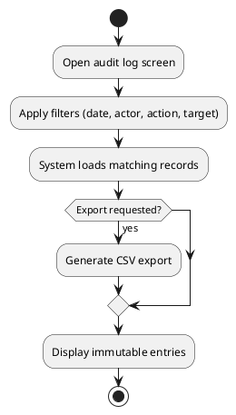

#### Business Rules

| Activity  | BR Code | Description                                                            |
| --------- | ------- | ---------------------------------------------------------------------- |
| Integrity | BR10    | Audit records are append-only and cannot be edited/deleted from UI.    |
| Query     | BR11    | Filtering by date range, actor, action, and target entity is required. |
| Export    | BR12    | CSV export is restricted to authorized admins.                         |

### UC5: Add product and SKUs

|                          |                                                                   |
| ------------------------ | ----------------------------------------------------------------- |
| **Name**           | Add product and SKUs                                              |
| **Description**    | Staff creates product master and variant SKUs for sale channels.  |
| **Actor**          | Authorized Staff                                                  |
| **Trigger**        | Clicks `Catalog > Add Product`.                                 |
| **Pre-condition**  | Staff has `catalog.write` permission.                           |
| **Post-condition** | Product and SKUs are created and visible based on publish status. |

#### Activities Flow

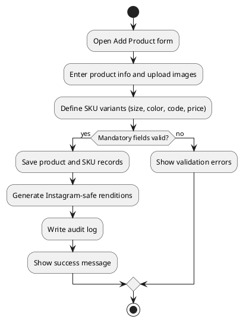

#### Business Rules

| Activity     | BR Code | Description                                                                                |
| ------------ | ------- | ------------------------------------------------------------------------------------------ |
| Validation   | BR13    | Product must have title, category, base price, and at least one image.                     |
| SKU identity | BR14    | SKU code is unique within system scope.                                                    |
| Media        | BR15    | Original media is preserved; Instagram-compatible rendition is generated for compose flow. |

### UC6: Adjust SKU inventory

|                          |                                                        |
| ------------------------ | ------------------------------------------------------ |
| **Name**           | Adjust SKU inventory                                   |
| **Description**    | Staff performs stock corrections per SKU and location. |
| **Actor**          | Authorized Staff                                       |
| **Trigger**        | Clicks `Inventory > Adjust`.                         |
| **Pre-condition**  | SKU and location exist.                                |
| **Post-condition** | Inventory balance is updated with reason trace.        |

#### Activities Flow

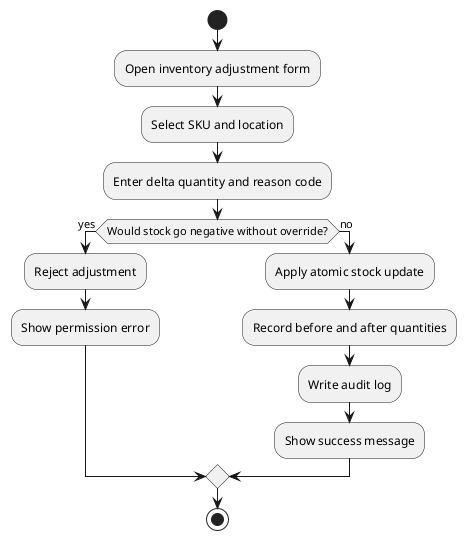

#### Business Rules

| Activity    | BR Code | Description                                           |
| ----------- | ------- | ----------------------------------------------------- |
| Reason code | BR16    | Adjustment reason is mandatory.                       |
| Safety      | BR17    | Negative stock requires explicit override permission. |
| Consistency | BR18    | Inventory update is atomic per SKU-location.          |

### UC7: Transfer stock between locations

|                          |                                                                                    |
| ------------------------ | ---------------------------------------------------------------------------------- |
| **Name**           | Transfer stock between locations                                                   |
| **Description**    | Staff creates and completes inventory transfer between nodes.                      |
| **Actor**          | Authorized Staff                                                                   |
| **Trigger**        | Clicks `Inventory > Transfer`.                                                   |
| **Pre-condition**  | Source has enough available quantity.                                              |
| **Post-condition** | Transfer status trail is updated and destination stock is increased on completion. |

#### Activities Flow

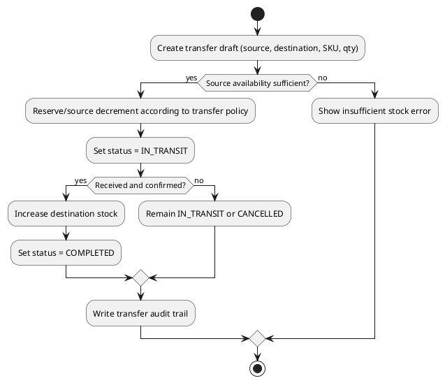

#### Business Rules

| Activity       | BR Code | Description                                                           |
| -------------- | ------- | --------------------------------------------------------------------- |
| Transfer model | BR19    | Statuses:`DRAFT`, `IN_TRANSIT`, `COMPLETED`, `CANCELLED`.     |
| Completion     | BR20    | Destination inventory is updated only when transfer is `COMPLETED`. |
| Traceability   | BR21    | Every status transition is audited.                                   |

### UC8: Process POS sale

|                          |                                                                     |
| ------------------------ | ------------------------------------------------------------------- |
| **Name**           | Process POS sale                                                    |
| **Description**    | Staff completes in-store sale and synchronizes inventory centrally. |
| **Actor**          | Authorized Staff                                                    |
| **Trigger**        | Clicks `POS > Checkout`.                                          |
| **Pre-condition**  | POS session active and cashier authorized.                          |
| **Post-condition** | Receipt is issued and stock is decremented atomically.              |

#### Activities Flow

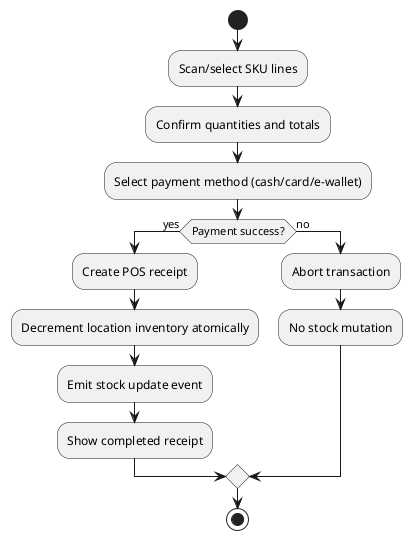

#### Business Rules

| Activity         | BR Code | Description                                                             |
| ---------------- | ------- | ----------------------------------------------------------------------- |
| Atomicity        | BR22    | Receipt creation and stock decrement are in one transactional boundary. |
| Failure handling | BR23    | On payment failure, transaction is rolled back.                         |
| Synchronization  | BR24    | POS completion emits inventory synchronization event.                   |

### UC9: Process refund

|                          |                                                                   |
| ------------------------ | ----------------------------------------------------------------- |
| **Name**           | Process refund                                                    |
| **Description**    | Staff processes full or partial refund for eligible transactions. |
| **Actor**          | Authorized Staff                                                  |
| **Trigger**        | Clicks `Orders/POS > Refund`.                                   |
| **Pre-condition**  | Original paid transaction exists and is refundable by policy.     |
| **Post-condition** | Refund record exists and stock is restored as policy dictates.    |

#### Activities Flow

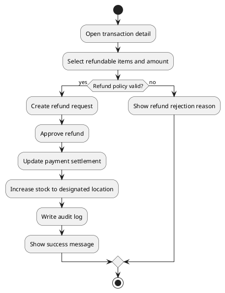

#### Business Rules

| Activity | BR Code | Description                                             |
| -------- | ------- | ------------------------------------------------------- |
| Coverage | BR25    | System supports full and partial refunds.               |
| Linkage  | BR26    | Refund must reference original order or POS receipt.    |
| Stock    | BR27    | Approved return increases stock at configured location. |

### UC10: Manage discount codes

|                          |                                                                            |
| ------------------------ | -------------------------------------------------------------------------- |
| **Name**           | Manage discount codes                                                      |
| **Description**    | Staff creates and controls promotional codes.                              |
| **Actor**          | Authorized Staff                                                           |
| **Trigger**        | Clicks `Promotions > Discount Codes`.                                    |
| **Pre-condition**  | Staff has promotion management permission.                                 |
| **Post-condition** | Discount code is created/updated and available for validation at checkout. |

#### Activities Flow

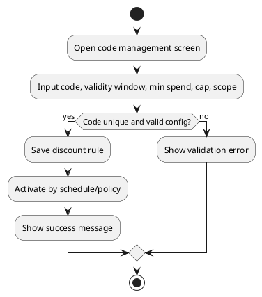

#### Business Rules

| Activity    | BR Code | Description                                                                         |
| ----------- | ------- | ----------------------------------------------------------------------------------- |
| Uniqueness  | BR28    | Discount code must be globally unique.                                              |
| Stacking    | BR29    | `v1` supports single-code per order; stacking is not allowed.                     |
| Constraints | BR30    | Rule can include validity period, usage cap, min spend, and product/category scope. |

### UC11: Compose Instagram draft

|                          |                                                                              |
| ------------------------ | ---------------------------------------------------------------------------- |
| **Name**           | Compose Instagram draft                                                      |
| **Description**    | Staff generates and edits a compose-ready Instagram draft from product data. |
| **Actor**          | Authorized Staff                                                             |
| **Trigger**        | Clicks `Marketing > Create Instagram Draft`.                               |
| **Pre-condition**  | Product media exists. Staff has marketing permission.                        |
| **Post-condition** | Draft caption and media ordering are saved for manual publishing.            |

#### Activities Flow

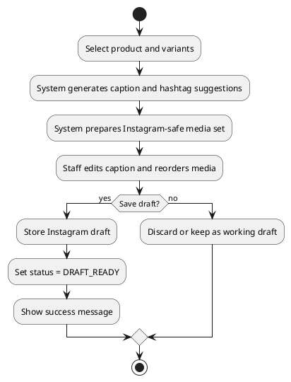

#### Business Rules

| Activity         | BR Code | Description                                                         |
| ---------------- | ------- | ------------------------------------------------------------------- |
| Editability      | BR31    | Caption and image ordering must be editable before publish handoff. |
| Approval gate    | BR32    | No automatic publish is allowed without manual approval.            |
| Asset compliance | BR33    | Draft uses Instagram-compatible image versions when available.      |

### UC12: Register account

|                          |                                                            |
| ------------------------ | ---------------------------------------------------------- |
| **Name**           | Register account                                           |
| **Description**    | Customer creates a new SeShop account.                     |
| **Actor**          | Customer                                                   |
| **Trigger**        | Clicks `Sign Up`.                                        |
| **Pre-condition**  | Customer is unauthenticated.                               |
| **Post-condition** | Account is created and verification workflow is initiated. |

#### Activities Flow

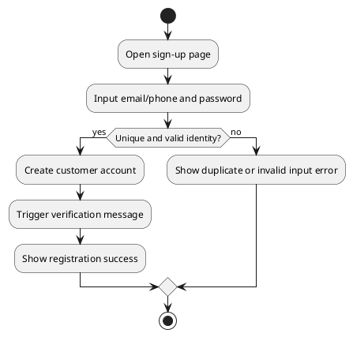

#### Business Rules

| Activity            | BR Code | Description                                  |
| ------------------- | ------- | -------------------------------------------- |
| Identity uniqueness | BR34    | Email and phone number must be unique.       |
| Verification        | BR35    | Verification flow can be enabled by policy.  |
| Security            | BR36    | Password policy requires minimum complexity. |

### UC13: Browse and filter variants

|                          |                                                                    |
| ------------------------ | ------------------------------------------------------------------ |
| **Name**           | Browse and filter variants                                         |
| **Description**    | Customer filters and compares product variants to decide purchase. |
| **Actor**          | Customer                                                           |
| **Trigger**        | Uses storefront search/filter controls.                            |
| **Pre-condition**  | Product catalog has published items.                               |
| **Post-condition** | Customer obtains a narrowed, comparable product set.               |

#### Activities Flow

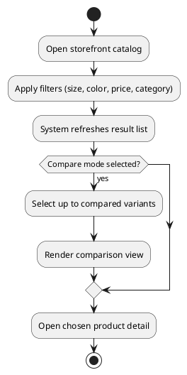

#### Business Rules

| Activity     | BR Code | Description                                         |
| ------------ | ------- | --------------------------------------------------- |
| Filtering    | BR37    | Multi-filter combination is supported.              |
| Availability | BR38    | Variant-level availability is shown inline.         |
| Comparison   | BR39    | Compare view supports at least 2 selected variants. |

### UC14: AI recommendation chat

|                          |                                                                        |
| ------------------------ | ---------------------------------------------------------------------- |
| **Name**           | AI recommendation chat                                                 |
| **Description**    | Customer requests personalized recommendations and adds items to cart. |
| **Actor**          | Customer                                                               |
| **Trigger**        | Opens AI assistant and sends prompt.                                   |
| **Pre-condition**  | AI assistant service is available.                                     |
| **Post-condition** | Recommended items are displayed and can be added to cart.              |

#### Activities Flow

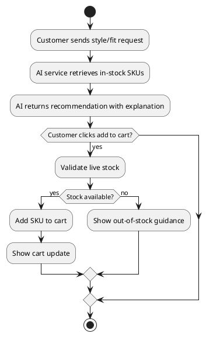

#### Business Rules

| Activity                 | BR Code | Description                                                      |
| ------------------------ | ------- | ---------------------------------------------------------------- |
| Recommendation relevance | BR40    | AI should prioritize currently available SKUs.                   |
| Explainability           | BR41    | Response includes recommendation rationale.                      |
| Cart safety              | BR42    | Add-to-cart action must perform stock validation at commit time. |

### UC15: Checkout and pay

|                          |                                                                                            |
| ------------------------ | ------------------------------------------------------------------------------------------ |
| **Name**           | Checkout and pay                                                                           |
| **Description**    | Customer confirms order details and completes payment.                                     |
| **Actor**          | Customer                                                                                   |
| **Trigger**        | Clicks `Checkout` from cart.                                                             |
| **Pre-condition**  | Cart has valid purchasable items.                                                          |
| **Post-condition** | Order is created; payment status is stored; reservation is released/converted accordingly. |

#### Activities Flow

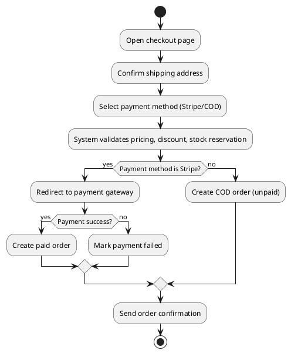

#### Business Rules

| Activity           | BR Code | Description                                                |
| ------------------ | ------- | ---------------------------------------------------------- |
| Payment options    | BR43    | `v1` supports Stripe and COD in online checkout.         |
| Reservation window | BR44    | Checkout stock reservation timeout is 15 minutes.          |
| Integrity          | BR45    | Failed online payment must not produce a paid order state. |

### UC16: View stock by location

|                          |                                                               |
| ------------------------ | ------------------------------------------------------------- |
| **Name**           | View stock by location                                        |
| **Description**    | Customer sees SKU availability by location node display name. |
| **Actor**          | Customer                                                      |
| **Trigger**        | Opens product detail and selects variant.                     |
| **Pre-condition**  | SKU and location inventory balances exist.                    |
| **Post-condition** | Availability list is displayed by location.                   |

#### Activities Flow

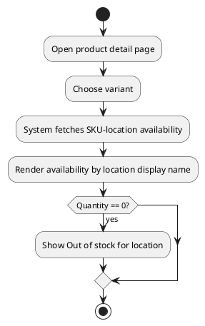

#### Business Rules

| Activity   | BR Code | Description                                                                        |
| ---------- | ------- | ---------------------------------------------------------------------------------- |
| Visibility | BR46    | Customer sees location name and availability count, not internal node type labels. |
| Freshness  | BR47    | Availability is refreshed after stock-affecting events.                            |
| Accuracy   | BR48    | Quantity shown corresponds to sellable available stock.                            |

### UC17: Track shipment

|                          |                                                                  |
| ------------------------ | ---------------------------------------------------------------- |
| **Name**           | Track shipment                                                   |
| **Description**    | Customer tracks order delivery progress from account order page. |
| **Actor**          | Customer                                                         |
| **Trigger**        | Opens `My Orders > Order Detail`.                              |
| **Pre-condition**  | Order is confirmed and shipment object exists.                   |
| **Post-condition** | Shipment timeline and tracking link are shown.                   |

#### Activities Flow

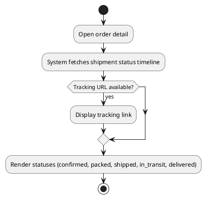

#### Business Rules

| Activity      | BR Code | Description                                                                             |
| ------------- | ------- | --------------------------------------------------------------------------------------- |
| Timeline      | BR49    | Minimum statuses:`CONFIRMED`, `PACKED`, `SHIPPED`, `IN_TRANSIT`, `DELIVERED`. |
| Notifications | BR50    | Customer is notified on major shipment status transitions.                              |
| External sync | BR51    | Tracking status may be synchronized from shipping partner APIs.                         |

### UC18: Leave review with image

|                          |                                                                    |
| ------------------------ | ------------------------------------------------------------------ |
| **Name**           | Leave review with image                                            |
| **Description**    | Customer submits post-purchase product rating and optional images. |
| **Actor**          | Customer                                                           |
| **Trigger**        | Clicks `Leave Review` from purchased item detail.                |
| **Pre-condition**  | Customer purchased the item and review window is open.             |
| **Post-condition** | Review is stored and appears after moderation policy passes.       |

#### Activities Flow

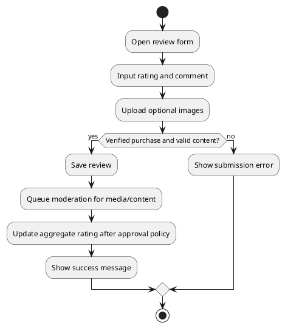

#### Business Rules

| Activity    | BR Code | Description                                             |
| ----------- | ------- | ------------------------------------------------------- |
| Eligibility | BR52    | Only verified purchasers can submit product reviews.    |
| Moderation  | BR53    | Image uploads are subject to moderation workflow.       |
| Scoring     | BR54    | Approved ratings contribute to product aggregate score. |

### UC19: View pending online orders

|                          |                                                                                             |
| ------------------------ | ------------------------------------------------------------------------------------------- |
| **Name**           | View pending online orders                                                                  |
| **Description**    | Staff reviews pending orders and updates preparation status for fulfillment operations.     |
| **Actor**          | Authorized Staff                                                                            |
| **Trigger**        | Opens `Orders > Pending`.                                                                  |
| **Pre-condition**  | Staff has `order.read` permission and at least one order exists in actionable status.      |
| **Post-condition** | Pending order list and selected order details are displayed for pick and pack processing.   |

#### Activities Flow

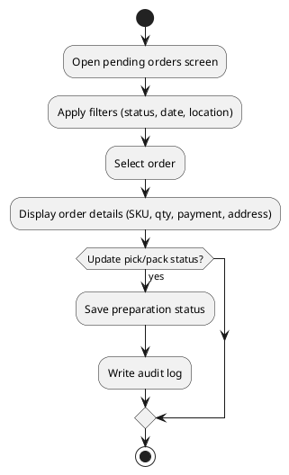

#### Business Rules

| Activity           | BR Code | Description                                                                 |
| ------------------ | ------- | --------------------------------------------------------------------------- |
| Filtering          | BR55    | Staff can filter by status, date range, and fulfillment location.           |
| Order visibility   | BR56    | Order detail must include SKU lines, quantities, payment state, and address. |
| Preparation status | BR57    | Pick and pack status updates are auditable and role-controlled.             |

### UC20: Mark order as shipped with tracking

|                          |                                                                                           |
| ------------------------ | ----------------------------------------------------------------------------------------- |
| **Name**           | Mark order as shipped with tracking                                                       |
| **Description**    | Staff transitions a prepared order to shipped state and sets tracking metadata.          |
| **Actor**          | Authorized Staff                                                                          |
| **Trigger**        | Clicks `Mark as shipped` on order detail.                                                |
| **Pre-condition**  | Order is in shippable state and staff has `order.ship` permission.                       |
| **Post-condition** | Order shipment status is updated and customer notification is sent.                       |

#### Activities Flow

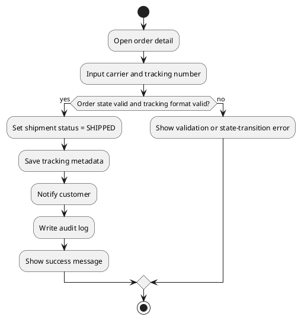

#### Business Rules

| Activity          | BR Code | Description                                                                   |
| ----------------- | ------- | ----------------------------------------------------------------------------- |
| State transition  | BR58    | Only eligible order states can transition to `SHIPPED`.                       |
| Tracking quality  | BR59    | Tracking number format validation is required before shipping confirmation.   |
| Notification      | BR60    | Customer is notified immediately after successful shipping update.            |

### UC21: Connect or reconnect Instagram account

|                          |                                                                                      |
| ------------------------ | ------------------------------------------------------------------------------------ |
| **Name**           | Connect or reconnect Instagram account                                               |
| **Description**    | Staff authorizes SeShop to access Instagram features for social compose operations. |
| **Actor**          | Authorized Staff                                                                     |
| **Trigger**        | Clicks `Marketing > Connect Instagram`.                                             |
| **Pre-condition**  | Staff has marketing integration permission.                                          |
| **Post-condition** | Integration token is stored securely and account connection status is updated.        |

#### Activities Flow

```plantuml
@startuml
start
:Open Instagram integration settings;
:Redirect to OAuth consent flow;
if (OAuth granted?) then (yes)
  :Exchange auth code for tokens;
  :Store encrypted token set;
  :Validate required scopes;
  :Set integration status = CONNECTED;
  :Write audit log;
  :Show success message;
else (no)
  :Keep status = DISCONNECTED;
  :Show cancellation or authorization error;
endif
if (Reconnect requested due to expiry?) then (yes)
  :Run reconnect flow and rotate token;
endif
stop
@enduml
```

#### Business Rules

| Activity         | BR Code | Description                                                                      |
| ---------------- | ------- | -------------------------------------------------------------------------------- |
| OAuth scope      | BR61    | Required Instagram scopes must be validated before connection is marked active.  |
| Token lifecycle  | BR62    | Access/refresh tokens are encrypted at rest and rotated on reconnect.            |
| Governance       | BR63    | Connect/reconnect/disconnect actions are fully audited with actor metadata.      |

### UC22: Purchase order and stock receiving

|                          |                                                                                     |
| ------------------------ | ----------------------------------------------------------------------------------- |
| **Name**           | Purchase order and stock receiving                                                   |
| **Description**    | Staff creates purchase orders and receives inbound stock into selected locations.    |
| **Actor**          | Authorized Staff                                                                      |
| **Trigger**        | Clicks `Inventory > Purchase Order`.                                                |
| **Pre-condition**  | Supplier master data exists and staff has inventory procurement permission.           |
| **Post-condition** | Received quantities update inventory balances and goods receipt audit entries exist.  |

#### Activities Flow

```plantuml
@startuml
start
:Create purchase order with supplier and SKU lines;
:Submit PO for approval;
if (PO approved?) then (yes)
  :Receive shipment at destination location;
  :Record received and damaged quantities;
  :Post goods receipt;
  :Increase on-hand inventory;
  :Write audit log;
else (no)
  :Return PO for correction;
endif
stop
@enduml
```

#### Business Rules

| Activity        | BR Code | Description                                                                 |
| --------------- | ------- | --------------------------------------------------------------------------- |
| PO control      | BR64    | Purchase order must include supplier, destination location, and SKU lines. |
| Receiving       | BR65    | Received quantity can be partial and must track damaged quantity separately. |
| Stock posting   | BR66    | Inventory increases only after goods receipt is posted successfully.         |

### UC23: Allocate order to fulfillment location

|                          |                                                                                   |
| ------------------------ | --------------------------------------------------------------------------------- |
| **Name**           | Allocate order to fulfillment location                                             |
| **Description**    | System and staff assign online order lines to optimal fulfillment location(s).     |
| **Actor**          | Authorized Staff                                                                    |
| **Trigger**        | New paid or COD order enters fulfillment queue.                                    |
| **Pre-condition**  | Order exists with sellable stock in one or more locations.                         |
| **Post-condition** | Allocation decision is recorded and pick tasks are generated.                      |

#### Activities Flow

```plantuml
@startuml
start
:Load allocatable order lines;
:Evaluate candidate locations by policy;
if (Single location can fulfill all lines?) then (yes)
  :Assign order to one location;
else (no)
  :Split order by line or quantity across locations;
endif
:Reserve stock at assigned locations;
:Create pick tasks;
:Write allocation audit log;
stop
@enduml
```

#### Business Rules

| Activity         | BR Code | Description                                                                      |
| ---------------- | ------- | -------------------------------------------------------------------------------- |
| Allocation policy | BR67   | Priority order: available stock, shipping SLA, and configured location priority. |
| Reservation       | BR68   | Allocated stock must be reserved to prevent oversell.                            |
| Split shipment    | BR69   | Split shipment is allowed when one location cannot fulfill complete order.        |

### UC24: Return intake and exchange

|                          |                                                                                     |
| ------------------------ | ----------------------------------------------------------------------------------- |
| **Name**           | Return intake and exchange                                                           |
| **Description**    | Staff processes reverse logistics from return request to inspection and exchange.    |
| **Actor**          | Authorized Staff                                                                      |
| **Trigger**        | Customer submits return or exchange request for eligible order item.                 |
| **Pre-condition**  | Original order item is within return window and policy scope.                        |
| **Post-condition** | Return disposition is completed and refund/exchange stock updates are recorded.      |

#### Activities Flow

```plantuml
@startuml
start
:Receive return request;
if (Policy eligible?) then (yes)
  :Approve return and issue RMA;
  :Receive returned item;
  :Inspect condition;
  if (Exchange requested?) then (yes)
    :Allocate replacement SKU;
    :Create outbound shipment;
  else (no)
    :Create refund settlement;
  endif
  :Restock or dispose based on condition;
  :Write audit log;
else (no)
  :Reject request with reason;
endif
stop
@enduml
```

#### Business Rules

| Activity         | BR Code | Description                                                                     |
| ---------------- | ------- | ------------------------------------------------------------------------------- |
| Eligibility      | BR70    | Return must satisfy window, product condition, and non-final-sale constraints. |
| Inspection       | BR71    | Disposition options: `RESTOCK`, `REFURBISH`, `DISPOSE`.                        |
| Exchange linkage | BR72    | Exchange order must reference original order line and RMA record.              |

### UC25: Cycle count and inventory reconciliation

|                          |                                                                                         |
| ------------------------ | --------------------------------------------------------------------------------------- |
| **Name**           | Cycle count and inventory reconciliation                                                  |
| **Description**    | Staff runs periodic stock counts and reconciles variances with approval workflow.        |
| **Actor**          | Authorized Staff                                                                          |
| **Trigger**        | Scheduled cycle count window starts or ad-hoc count is initiated.                        |
| **Pre-condition**  | Count scope (location, category, SKU set) is defined.                                    |
| **Post-condition** | Approved variances are posted and reconciliation report is generated.                     |

#### Activities Flow

```plantuml
@startuml
start
:Create cycle count batch;
:Freeze count scope snapshot;
:Capture counted quantities;
:Calculate variance against system stock;
if (Variance exceeds threshold?) then (yes)
  :Route for supervisor approval;
endif
:Post approved adjustments;
:Generate reconciliation report;
:Write audit log;
stop
@enduml
```

#### Business Rules

| Activity          | BR Code | Description                                                                  |
| ----------------- | ------- | ---------------------------------------------------------------------------- |
| Count integrity   | BR73    | Count scope snapshot must remain immutable during counting session.          |
| Approval control  | BR74    | Variance beyond threshold requires supervisor approval before posting.       |
| Reconciliation    | BR75    | System stores variance reason code and reconciliation reference for auditing. |

### UC26: POS shift close and cash reconciliation

|                          |                                                                                        |
| ------------------------ | -------------------------------------------------------------------------------------- |
| **Name**           | POS shift close and cash reconciliation                                                  |
| **Description**    | Cashier closes shift, reconciles drawer, and submits discrepancy for approval if needed. |
| **Actor**          | Authorized Staff                                                                         |
| **Trigger**        | Clicks `POS > Close Shift`.                                                             |
| **Pre-condition**  | POS shift is open and terminal has transactions.                                         |
| **Post-condition** | Shift summary is finalized and cash discrepancy workflow is completed.                   |

#### Activities Flow

```plantuml
@startuml
start
:Load shift transaction summary;
:Count physical cash drawer;
:Compare expected vs actual cash;
if (Discrepancy detected?) then (yes)
  :Capture discrepancy reason;
  :Submit for supervisor review;
else (no)
  :Finalize shift close;
endif
:Publish end-of-shift report;
:Write audit log;
stop
@enduml
```

#### Business Rules

| Activity            | BR Code | Description                                                              |
| ------------------- | ------- | ------------------------------------------------------------------------ |
| Shift closure       | BR76    | Shift cannot close with pending unsaved transactions.                    |
| Cash reconciliation | BR77    | Cash variance must record reason and approver for threshold breaches.    |
| Reporting           | BR78    | End-of-shift report must include payment method totals and variance.     |

### UC27: Generate tax invoice and adjustment note

|                          |                                                                                       |
| ------------------------ | ------------------------------------------------------------------------------------- |
| **Name**           | Generate tax invoice and adjustment note                                               |
| **Description**    | Staff generates compliant invoices and correction notes for online and POS orders.    |
| **Actor**          | Authorized Staff                                                                        |
| **Trigger**        | Clicks `Orders/POS > Generate Invoice` or `Create Adjustment Note`.                   |
| **Pre-condition**  | Transaction is completed and invoice-eligible by policy.                               |
| **Post-condition** | Invoice or adjustment note is issued, stored, and linked to source transaction.        |

#### Activities Flow

```plantuml
@startuml
start
:Load transaction financial details;
:Generate tax invoice draft;
if (Validation passed?) then (yes)
  :Issue invoice number;
  :Store invoice document;
  if (Correction requested?) then (yes)
    :Create adjustment note linked to original invoice;
  endif
  :Write audit log;
  :Show success message;
else (no)
  :Show validation errors;
endif
stop
@enduml
```

#### Business Rules

| Activity            | BR Code | Description                                                                 |
| ------------------- | ------- | --------------------------------------------------------------------------- |
| Invoice generation  | BR79    | Invoice must include tax fields required by configured legal jurisdiction.  |
| Correction process  | BR80    | Adjustment note must reference original invoice and immutable reason trail. |
| Document integrity  | BR81    | Issued financial documents are immutable and versioned by correction chain. |

# List Description

SeShop List Description.xlsx

# View Description

SeShop View Description.xlsx

# Requirements Traceability Matrix

| Story ID | Story Summary | UC ID | FR ID(s) | NFR ID(s) |
| --- | --- | --- | --- | --- |
| US-RBAC-01 | Create custom role | UC1 | FR-02 | NFR-04, NFR-05 |
| US-RBAC-02 | Assign permissions to role | UC2 | FR-03 | NFR-04, NFR-05 |
| US-RBAC-03, US-RBAC-04 | Assign/revoke staff role | UC3 | FR-04, FR-05 | NFR-04, NFR-05 |
| US-RBAC-05 | View immutable audit logs | UC4 | FR-19, FR-20 | NFR-05 |
| US-CAT-01, US-CAT-02 | Add product and SKU with social-ready media | UC5 | FR-06 | NFR-07 |
| US-INV-01 | Adjust SKU inventory | UC6 | FR-07, FR-08 | NFR-02 |
| US-INV-02 | Transfer stock between locations | UC7 | FR-09 | NFR-02, NFR-06 |
| US-POS-01 | Process POS sale | UC8 | FR-12, FR-14 | NFR-02, NFR-03 |
| US-REF-01 | Process refund | UC9 | FR-13, FR-14 | NFR-02 |
| US-MKT-01 | Manage discount codes | UC10 | FR-15 | NFR-07 |
| US-MKT-03 | Compose Instagram draft | UC11 | FR-16, FR-17 | NFR-07 |
| US-CUS-01 | Register account | UC12 | FR-01 | NFR-04 |
| US-CUS-02 | Browse and compare variants | UC13 | FR-06, FR-10 | NFR-01 |
| US-CUS-03, US-CUS-04 | AI recommendations and add-to-cart | UC14 | FR-18 | NFR-01 |
| US-CUS-05 | Checkout and pay | UC15 | FR-11 | NFR-02, NFR-04 |
| US-INV-03 | View stock by location | UC16 | FR-10 | NFR-01 |
| US-CUS-06 | Track shipment | UC17 | FR-11 | NFR-03 |
| US-CUS-07 | Leave review with image | UC18 | FR-06 | NFR-07 |
| US-ORD-01 | View pending online orders | UC19 | FR-11 | NFR-07 |
| US-ORD-02 | Mark order shipped with tracking | UC20 | FR-11 | NFR-03 |
| US-MKT-02 | Connect Instagram integration | UC21 | FR-16 | NFR-04 |
| US-OPS-01 | Purchase order and receiving | UC22 | FR-21 | NFR-02, NFR-05 |
| US-OPS-02 | Order allocation by location | UC23 | FR-22 | NFR-01, NFR-02 |
| US-OPS-03 | Return intake and exchange | UC24 | FR-23 | NFR-02, NFR-07 |
| US-OPS-04 | Cycle count reconciliation | UC25 | FR-24 | NFR-02, NFR-05 |
| US-OPS-05 | POS shift close and cash reconciliation | UC26 | FR-25 | NFR-05, NFR-07 |
| US-OPS-06 | Tax invoice and adjustment note | UC27 | FR-26 | NFR-05 |

# Non-functional Requirements

## **3.1. User Access and Security**

| **Function**          | **Super Admin** | **Authorized Staff** | **Customer** |
| --------------------------- | :-------------------: | :------------------------: | :----------------: |
| Sign up / Sign in           |           X           |             X             |         X         |
| Create custom role          |           X           |                            |                    |
| Assign permission to role   |           X           |                            |                    |
| Assign or revoke staff role |           X           |                            |                    |
| View audit log              |           X           |                            |                    |
| Add product and SKUs        |           X           |             X             |                    |
| Adjust SKU inventory        |           X           |             X             |                    |
| Transfer stock              |           X           |             X             |                    |
| Process POS sale            |           X           |             X             |                    |
| Process refund              |           X           |             X             |                    |
| Manage discount codes       |           X           |             X             |                    |
| Compose Instagram draft     |           X           |             X             |                    |
| Connect Instagram account   |           X           |             X             |                    |
| View pending online orders  |           X           |             X             |                    |
| Mark order shipped          |           X           |             X             |                    |
| Purchase order and receiving |          X           |             X             |                    |
| Allocate order to location   |          X           |             X             |                    |
| Return intake and exchange   |          X           |             X             |                    |
| Cycle count reconciliation   |          X           |             X             |                    |
| POS shift close and cash reconciliation | X        |             X             |                    |
| Generate tax invoice and adjustment note | X       |             X             |                    |
| Browse/filter variants      |                      |                            |         X         |
| AI recommendation chat      |                      |                            |         X         |
| Checkout and pay            |                      |                            |         X         |
| View stock by location      |                      |                            |         X         |
| Track shipment              |                      |                            |         X         |
| Leave review with image     |                      |                            |         X         |

`X`: Actor has permission by default role policy. Final access is permission-driven.

## **3.2. Performance Requirements**

**Number of users**

- Concurrent active users target: TBD (finalized during solution sizing).
- Registered business users and customers growth: scalable without schema redesign.

**Data volume**

- Product and media data expected to grow continuously with campaign seasons.
- Inventory and order event streams are high-frequency write paths.

**Performance targets**

- 95th percentile product search/filter response <= 2 seconds.
- Inventory update commit latency target <= 500 ms for standard operations.

**Availability target**

- Core commerce services target 99.9% monthly availability.

## **3.3. Implementation Requirements**

**Location**

Ho Chi Minh City

**Read-only Duration**

Maximum 2 hours during planned maintenance windows

**Read-only Timeframe**

Sunday 23:00 (local timezone), if required by release activity

**Maintenance Window**

Weekly planned maintenance on Sunday night with prior notice and rollback plan

**Overall conversion timeline**

Milestone releases on agreed sprint boundaries

**Language and localization policy**

- Customer-facing and back-office UI shall support `Vietnamese` and `English`.
- Message definitions in this SRS are canonical intent strings; implementation must provide localized `vi` and `en` variants.

# Appendixes

## Glossary

| **Term** | **Description**               |
| -------------- | ----------------------------------- |
| BR             | Business Rule                       |
| BRD            | Business Requirements Document      |
| NFR            | Non-functional Requirement          |
| RBAC           | Role-Based Access Control           |
| SKU            | Stock Keeping Unit                  |
| POS            | Point of Sale                       |
| SRS            | Software Requirements Specification |
| UC             | Use Case                            |
| MSG            | Message                             |
| TBD            | To Be Determined                    |

## Messages

All messages must be localized for both `vi` and `en` in implementation.

| **Message Code** | **Message Content**                                          | **Button** |
| ---------------------- | ------------------------------------------------------------------ | ---------------- |
| MSG 1                  | Are you sure you want to continue this action?                     | OK/Cancel        |
| MSG 2                  | Required fields are missing. Please complete all mandatory inputs. |                  |
| MSG 3                  | Role created successfully.                                         |                  |
| MSG 4                  | Permissions assigned successfully.                                 |                  |
| MSG 5                  | Staff role assignment updated successfully.                        |                  |
| MSG 6                  | You do not have permission for this action.                        |                  |
| MSG 7                  | Product and SKU created successfully.                              |                  |
| MSG 8                  | Inventory adjusted successfully.                                   |                  |
| MSG 9                  | Inventory transfer created successfully.                           |                  |
| MSG 10                 | POS sale completed successfully.                                   |                  |
| MSG 11                 | Refund processed successfully.                                     |                  |
| MSG 12                 | Discount code saved successfully.                                  |                  |
| MSG 13                 | Instagram draft saved successfully.                                |                  |
| MSG 14                 | Registration successful. Please verify your account.               |                  |
| MSG 15                 | AI recommendation added to cart successfully.                      |                  |
| MSG 16                 | Payment completed successfully.                                    |                  |
| MSG 17                 | Payment failed. Please retry or choose another method.             |                  |
| MSG 18                 | Tracking information is currently unavailable.                     |                  |
| MSG 19                 | Review submitted successfully.                                     |                  |
| MSG 20                 | Duplicate code or identifier detected.                             |                  |
| MSG 21                 | Invalid input format detected.                                     |                  |
| MSG 22                 | Insufficient stock for requested operation.                        |                  |
| MSG 23                 | Purchase order created successfully.                               |                  |
| MSG 24                 | Goods receipt posted successfully.                                 |                  |
| MSG 25                 | Order allocation completed successfully.                           |                  |
| MSG 26                 | Return or exchange processed successfully.                         |                  |
| MSG 27                 | Shift close submitted with reconciliation result.                  |                  |
| MSG 28                 | Tax invoice or adjustment note issued successfully.                |                  |

## Issues List

- TBD: Finalize external shipment provider webhook contract and retry policy.
- TBD: Confirm AI recommendation safety policy for user prompts and output filtering.
- TBD: Approve final bilingual message catalog (`Vietnamese`, `English`) for production.
