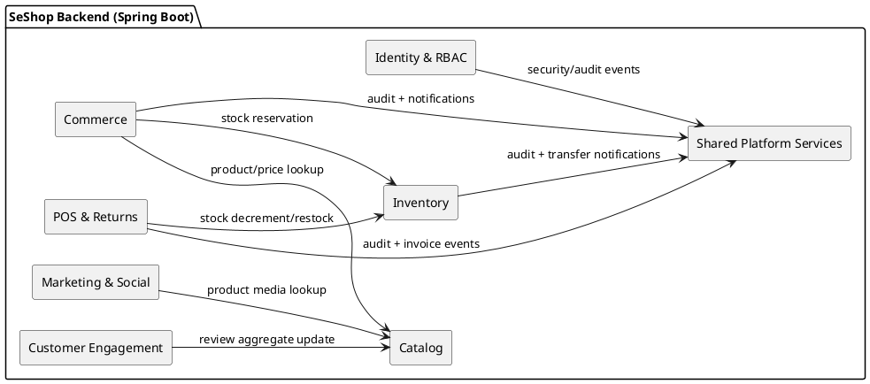
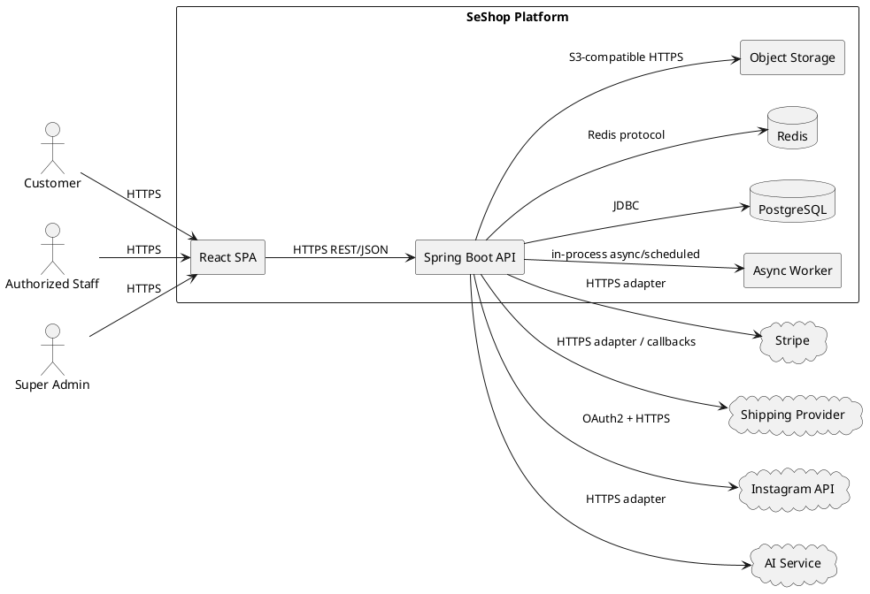
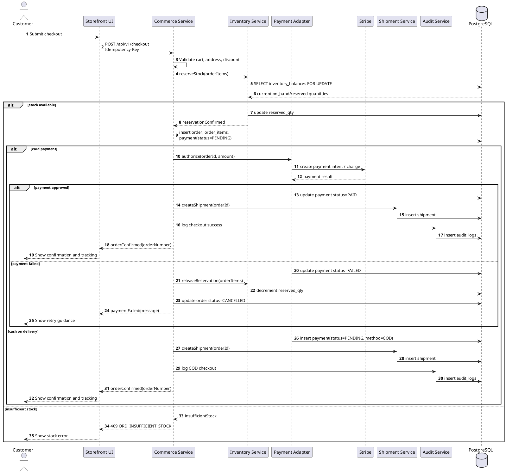
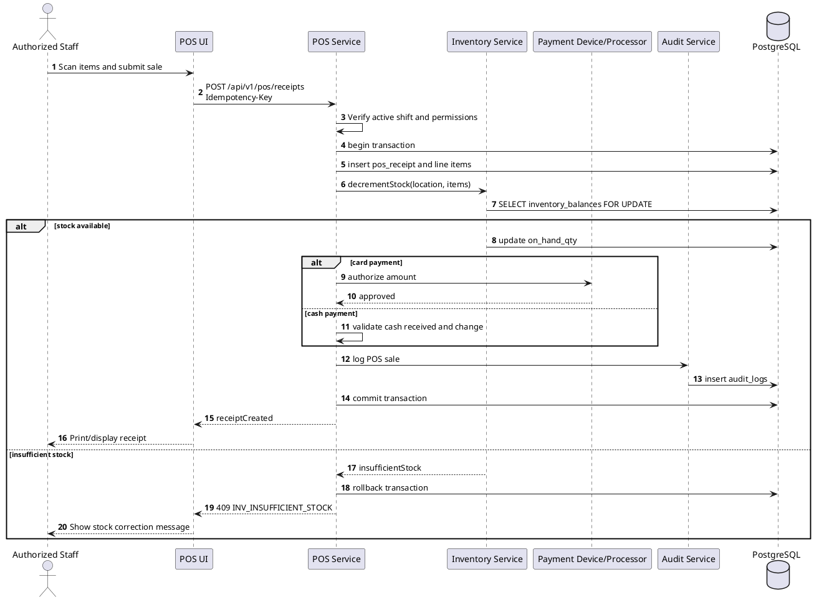
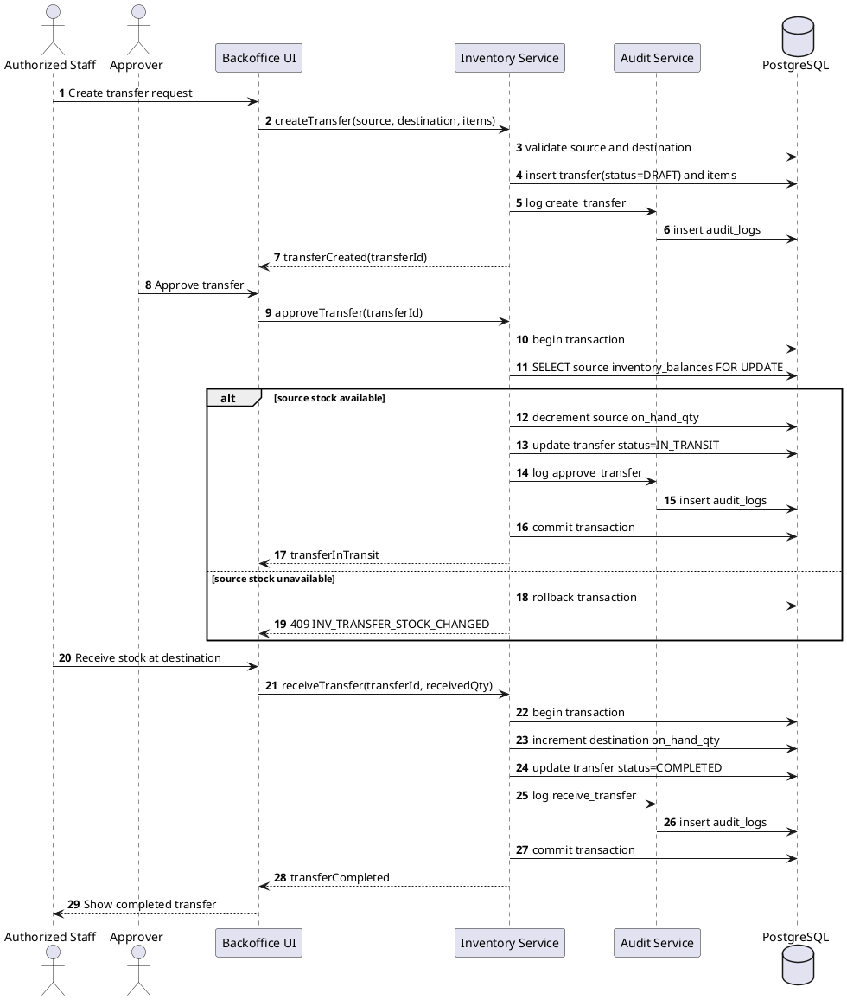
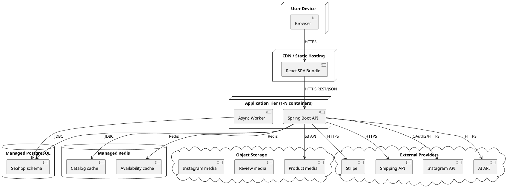

# SeShop

# SeShop Software Architecture Document (SAD)

# Content Owner: Architecture Team

| Document Number | Release/Revision | Release/Revision Date |
| --------------- | ---------------- | --------------------- |
| SESHOP-SAD-001  | 1.1              | 2026-05-07            |

| Field               | Value                                                         |
| ------------------- | ------------------------------------------------------------- |
| Project             | SeShop                                                        |
| Domain              | Omnichannel clothing and accessories platform                 |
| Template Source     | [Template/SAD Template.docx](../../Template/SAD%20Template.docx) |
| Architecture Method | SEI / Carnegie Mellon Views and Beyond                        |
| Status              | Draft baseline for project review                             |

---

## Revision History

| Date       | Version | Author            | Description                                                                                               |
| ---------- | ------: | ----------------- | --------------------------------------------------------------------------------------------------------- |
| 2026-04-30 |     1.0 | Architecture Team | Initial SAD using Views and Beyond framework                                                              |
| 2026-05-07 |     1.1 | Architecture Team | Reformatted to match SAD Template.docx and replaced textual runtime flows with PlantUML sequence diagrams |

---

# Table of Contents

1. [Documentation Roadmap](#1-documentation-roadmap)
   1. [Document Management and Configuration Control Information](#11-document-management-and-configuration-control-information)
   2. [Purpose and Scope of the SAD](#12-purpose-and-scope-of-the-sad)
   3. [How the SAD Is Organized](#13-how-the-sad-is-organized)
   4. [Stakeholder Representation](#14-stakeholder-representation)
   5. [Viewpoint Definitions](#15-viewpoint-definitions)
   6. [How a View is Documented](#16-how-a-view-is-documented)
   7. [Relationship to Other SADs](#17-relationship-to-other-sads)
   8. [Process for Updating this SAD](#18-process-for-updating-this-sad)
2. [Architecture Background](#2-architecture-background)
3. [Views](#3-views)
4. [Relations Among Views](#4-relations-among-views)
5. [Referenced Materials](#5-referenced-materials)
6. [Directory](#6-directory)
7. [Appendices](#7-appendices)

# List of Figures

| Figure   | Title                                  | Section                               |
| -------- | -------------------------------------- | ------------------------------------- |
| Figure 1 | Module decomposition                   | [3.1.5.1.1](#31511-primary-presentation) |
| Figure 2 | System context                         | [3.2.5.1.1](#32511-primary-presentation) |
| Figure 3 | Customer checkout and payment sequence | [3.2.5.1.4](#32514-behavior)             |
| Figure 4 | POS sale sequence                      | [3.2.5.1.4](#32514-behavior)             |
| Figure 5 | Stock transfer approval sequence       | [3.2.5.1.4](#32514-behavior)             |
| Figure 6 | Deployment topology                    | [3.3.5.1.1](#33511-primary-presentation) |

# List of Tables

| Table   | Title                                | Section                            |
| ------- | ------------------------------------ | ---------------------------------- |
| Table 1 | Stakeholders and relevant viewpoints | [1.4](#14-stakeholder-representation) |
| Table 2 | Module catalog                       | [3.1.5.1.2](#31512-element-catalog)   |
| Table 3 | Runtime component catalog            | [3.2.5.1.2](#32512-element-catalog)   |
| Table 4 | Connector catalog                    | [3.2.5.1.2](#32512-element-catalog)   |
| Table 5 | Infrastructure catalog               | [3.3.5.1.2](#33512-element-catalog)   |
| Table 6 | View relations                       | [4.2](#42-view-to-view-relations)     |

---

# 1. Documentation Roadmap

The Documentation Roadmap is the starting point for readers who need to understand what architectural information is included, which views are represented, and where to find details relevant to their role.

## 1.1 Document Management and Configuration Control Information

| Item                | Value                                                                                                                                       |
| ------------------- | ------------------------------------------------------------------------------------------------------------------------------------------- |
| Current revision    | 1.1                                                                                                                                         |
| Release date        | 2026-05-07                                                                                                                                  |
| Purpose of revision | Align the SAD with the provided SAD template and ensure behavioral flows are represented as PlantUML sequence diagrams.                     |
| Scope of revision   | Full document structure, section naming, viewpoint definitions, view documentation format, references, glossary, and runtime flow diagrams. |
| Controlled source   | `docs/3.Design/SESHOP SAD.md`                                                                                                             |

## 1.2 Purpose and Scope of the SAD

This SAD specifies the software architecture for SeShop, an omnichannel retail platform that unifies customer storefront shopping, staff operations, POS, inventory control, social marketing workflows, and secure governance.

The SAD documents architecture-level information: major elements, externally visible responsibilities, relationships, runtime behavior, deployment mapping, and cross-view consistency. Implementation details that are local to a class, function, screen component, or SQL statement are documented in the source code, API specification, schema, or view descriptions instead.

Included:

- Module decomposition and ownership.
- Runtime components, connectors, and important behavioral flows.
- Deployment topology and environment mapping.
- Relations among module, runtime, deployment, and data views.
- Architectural rationale, risks, glossary, and acronym list.

Not included:

- Full functional use-case descriptions; see the [SRS](../10.SRS/SESHOP%20SRS.md).
- Complete API endpoint definitions; see the [API specification](SESHOP%20API%20Spec.md).
- Full table and column descriptions; see the [Data Dictionary](../5.Database/SESHOP%20Data%20Dictionary.md).

## 1.3 How the SAD Is Organized

- **Section 1, Documentation Roadmap**, explains document purpose, audience, viewpoint definitions, and update process.
- **Section 2, Architecture Background**, summarizes the business problem, drivers, constraints, selected architectural approach, and requirement coverage.
- **Section 3, Views**, presents the architecture through module, component-and-connector, and deployment views.
- **Section 4, Relations Among Views**, maps elements across views so readers can trace how code modules become runtime components and deployed infrastructure.
- **Section 5, Referenced Materials**, lists documents and diagrams used as architecture sources.
- **Section 6, Directory**, provides index, glossary, and acronym list.
- **Section 7, Appendices**, records supplemental notes.

## 1.4 Stakeholder Representation

| Stakeholder                  | Primary Concerns                                                                   | Relevant Viewpoints                                                |
| ---------------------------- | ---------------------------------------------------------------------------------- | ------------------------------------------------------------------ |
| Business Owner               | Stock accuracy, order reliability, operational scope, release risk                 | Architecture Background, Component and Connector View              |
| Product Manager              | Use-case coverage, customer/staff experience, integration boundaries               | Architecture Background, Module View, Component and Connector View |
| Technical Lead               | Module boundaries, code ownership, quality attributes, change impact               | Module View, Relations Among Views                                 |
| Backend Developer            | Service boundaries, transaction rules, persistence ownership, integration adapters | Module View, Component and Connector View, Data relations          |
| Frontend Developer           | Client/API responsibilities, user-facing flows, error behavior                     | Component and Connector View, Referenced Materials                 |
| QA/UAT Team                  | Testable flows, quality attribute targets, traceability to requirements            | Component and Connector View, Relations Among Views                |
| DevOps/Operations            | Deployment units, health checks, secrets, recovery, monitoring                     | Deployment View, Architecture Background                           |
| Security/Compliance Reviewer | RBAC, audit, sensitive data handling, traceability                                 | Module View, Component and Connector View, Directory               |

## 1.5 Viewpoint Definitions

### 1.5.1 Module Viewpoint Definition

#### 1.5.1.1 Abstract

The Module Viewpoint describes the static organization of SeShop source code into business modules, internal layers, and ownership boundaries.

#### 1.5.1.2 Stakeholders and Their Concerns Addressed

Technical leads, backend developers, QA, and security reviewers use this viewpoint to reason about change impact, ownership, test scope, and access-control placement.

#### 1.5.1.3 Elements, Relations, Properties, and Constraints

Elements are modules, packages, layers, entities, and owned database tables. Relations include dependency direction, service-interface use, domain-event publication, and table ownership. The main constraint is that modules may not directly modify another module's owned data.

#### 1.5.1.4 Languages to Model/Represent Conforming Views

Markdown tables, package trees, and PlantUML component diagrams.

#### 1.5.1.5 Applicable Evaluation/Analysis Techniques and Consistency/Completeness Criteria

Evaluation uses dependency review, code ownership review, API contract review, and traceability against [ASR](SESHOP%20ASR.md) quality scenarios. A complete Module View identifies all major modules, their responsibilities, their internal layers, and owned tables.

#### 1.5.1.6 Viewpoint Source

SEI Views and Beyond module viewtype, adapted for a Spring Boot modular monolith.

### 1.5.2 Component and Connector Viewpoint Definition

#### 1.5.2.1 Abstract

The Component and Connector Viewpoint describes runtime elements, communication paths, protocols, and behavior during important workflows.

#### 1.5.2.2 Stakeholders and Their Concerns Addressed

Architects, backend developers, frontend developers, QA, DevOps, and security reviewers use this viewpoint to understand runtime behavior, API boundaries, integration failure handling, and sequence-level consistency.

#### 1.5.2.3 Elements, Relations, Properties, and Constraints

Elements are runtime components such as React SPA, Spring Boot API, PostgreSQL, Redis, object storage, async worker, and external providers. Relations are connectors such as HTTPS REST, JDBC, Redis protocol, S3-compatible API, OAuth, and in-process events. Sequence diagrams must be represented in PlantUML or Mermaid.

#### 1.5.2.4 Languages to Model/Represent Conforming Views

PlantUML component diagrams, PlantUML sequence diagrams, and connector tables.

#### 1.5.2.5 Applicable Evaluation/Analysis Techniques and Consistency/Completeness Criteria

Evaluation uses sequence walkthroughs, fault-injection planning, API contract review, idempotency review, and quality-attribute scenario coverage. A complete C&C view includes runtime components, connectors, key flows, and failure behavior for stock/money operations.

#### 1.5.2.6 Viewpoint Source

SEI Views and Beyond component-and-connector viewtype.

### 1.5.3 Deployment Viewpoint Definition

#### 1.5.3.1 Abstract

The Deployment Viewpoint maps software elements to infrastructure nodes and environments.

#### 1.5.3.2 Stakeholders and Their Concerns Addressed

DevOps, operations, technical leads, QA, and security reviewers use this viewpoint to reason about hosting, scaling, network paths, secrets, monitoring, and release consistency.

#### 1.5.3.3 Elements, Relations, Properties, and Constraints

Elements are deployment nodes, containers, managed services, storage services, and external provider endpoints. Relations include network calls, storage access, and environment mapping. Constraints include stateless API instances, PostgreSQL as source of truth, and secrets outside source control.

#### 1.5.3.4 Languages to Model/Represent Conforming Views

PlantUML deployment diagrams and environment mapping tables.

#### 1.5.3.5 Applicable Evaluation/Analysis Techniques and Consistency/Completeness Criteria

Evaluation uses deployment review, environment parity review, health-check review, backup/restore review, and security configuration review.

#### 1.5.3.6 Viewpoint Source

SEI Views and Beyond allocation/deployment viewtype.

## 1.6 How a View is Documented

Each view in Section 3 follows the template structure:

- **View Description:** purpose and scope of the view.
- **View Packet Overview:** view packets included in the section.
- **Architecture Background:** architectural drivers and rationale relevant to the view.
- **Variability Mechanisms:** planned extension points and controlled variation.
- **View Packets:** detailed packets with primary presentation, element catalog, context diagram, behavior, constraints, and related packets.

## 1.7 Relationship to Other SADs

No other SAD exists for SeShop version 1. This document is the primary architecture description. It references supporting artifacts rather than duplicating them.

| Document                                                               | Relationship to SAD                                                                          |
| ---------------------------------------------------------------------- | -------------------------------------------------------------------------------------------- |
| [SESHOP ADD](SESHOP%20ADD.md)                                             | Records design constraints, quality attribute requirements, and architecture representation. |
| [SESHOP ASR](SESHOP%20ASR.md)                                             | Defines the quality attribute scenarios that drive this architecture.                        |
| [SESHOP API Spec](SESHOP%20API%20Spec.md)                                 | Defines REST API conventions, endpoints, error model, and permission rules.                  |
| [SESHOP schema.sql](../5.Database/SESHOP%20schema.sql)                    | Defines the physical database schema.                                                        |
| [SESHOP Data Dictionary](../5.Database/SESHOP%20Data%20Dictionary.md)     | Explains table and column semantics.                                                         |
| [SeShop Views Desc](../4.%20View%20descriptions/SeShop%20Views%20Desc.md) | Defines UI view behavior and user-facing screen expectations.                                |

## 1.8 Process for Updating this SAD

This SAD should be updated when a change affects module boundaries, runtime connectors, quality attribute tactics, deployment topology, data ownership, or cross-view relationships.

Update process:

1. Record the reason for change in Revision History.
2. Update the affected view packet and any related view relations.
3. Update PlantUML sequence diagrams when runtime behavior changes.
4. Verify references to SRS, ASR, API, schema, and diagram files.
5. Review changes with architecture, backend, frontend, QA, and operations stakeholders when the change affects their concerns.

---

# 2. Architecture Background

## 2.1 Problem Background

### 2.1.1 System Overview

SeShop is a single-business omnichannel retail platform for clothing and accessories. It combines online storefront shopping, physical store operations, POS transactions, multi-location inventory, stock transfers, refunds, discounts, Instagram draft workflows, AI-assisted product discovery, RBAC, and immutable audit logging.

### 2.1.2 Goals and Context

The central architecture challenge is maintaining one accurate stock source across online checkout, in-store POS, transfers, procurement receiving, refunds, and staff adjustments. The platform must also keep governance flexible through permission-driven RBAC and remain understandable enough for a small team to build and operate.

Primary goals:

- Prevent overselling under concurrent checkout and POS activity.
- Keep stock, order, payment, and refund state consistent.
- Support configurable least-privilege staff operations.
- Keep staff workflows fast and auditable.
- Isolate external integrations behind replaceable adapters.
- Preserve a path to later decomposition without starting with microservice complexity.

### 2.1.3 Significant Driving Requirements

The following ASRs have the strongest architectural influence:

| ID    | Quality Attribute                    | Target                                                      |
| ----- | ------------------------------------ | ----------------------------------------------------------- |
| QAS-3 | Reliability - Checkout consistency   | Zero oversell events and no orphaned order/payment records. |
| QAS-5 | Security - RBAC enforcement          | 100% server-side permission enforcement.                    |
| QAS-7 | Auditability - Immutable audit trail | 100% coverage of sensitive operations.                      |
| QAS-1 | Performance - Product search         | p95 search response <= 2 seconds.                           |
| QAS-2 | Performance - Inventory mutation     | Standard stock commit latency <= 500 ms.                    |
| QAS-9 | Modifiability - Module boundaries    | Business rule changes normally affect one primary module.   |

## 2.2 Solution Background

### 2.2.1 Architectural Approaches

The selected architecture style is a **modular monolith**:

- One Spring Boot deployment contains all backend modules.
- Modules align with bounded business contexts.
- Cross-module behavior uses application service interfaces and domain events.
- PostgreSQL remains the transactional source of truth.
- External systems are isolated behind adapter interfaces.

This approach was selected over microservices because checkout, POS, refunds, transfers, and procurement receiving are stock/money workflows that benefit from single-database transactions. A microservice approach would add distributed transactions, sagas, message-broker operations, and network failure modes before the business scale requires them.

### 2.2.2 Analysis Results

The architecture satisfies the main quality attributes through:

- ACID transactions and row locking for stock-affecting commands.
- Permission-driven RBAC in backend controllers/services.
- Append-only audit records for sensitive operations.
- Indexed PostgreSQL tables and optional Redis caching for hot reads.
- Hexagonal module internals to isolate domain rules from infrastructure.
- Idempotency keys for checkout, payment confirmation, refunds, and transfer confirmation.
- Adapter interfaces for Stripe, shipping, Instagram, AI, object storage, and cache.

### 2.2.3 Requirements Coverage

| Requirement Area             | Architectural Coverage                                                         |
| ---------------------------- | ------------------------------------------------------------------------------ |
| RBAC and governance          | Identity & RBAC module, permission catalog, server-side checks, audit log.     |
| Catalog and browsing         | Catalog module, product/variant model, indexed queries, optional cache.        |
| Inventory accuracy           | Inventory module,`inventory_balances`, transaction boundaries, row locking.  |
| Online checkout              | Commerce module, payment adapter, reservation timeout, shipment orchestration. |
| POS and returns              | POS & Returns module, receipt/shift/refund/invoice workflows.                  |
| Social marketing             | Marketing & Social module, Instagram OAuth adapter, manual draft workflow.     |
| Customer engagement          | Review workflow and AI recommendation adapter.                                 |
| Operations and observability | Health checks, structured logs, trace IDs, environment parity.                 |

### 2.2.4 Summary of Background Changes Reflected in Current Version

Version 1.1 does not change the chosen architecture. It changes the document structure to follow the provided SAD template and replaces plain-text workflow call lists with PlantUML sequence diagrams.

## 2.3 Product Line Reuse Considerations

SeShop v1 is scoped to one business brand, so product-line variability is limited. Reuse is still supported through:

- Configurable roles and permissions.
- Data-driven locations and SKU variants.
- Adapter-based external providers.
- Localized message catalogs for Vietnamese and English.
- Module boundaries that allow future extraction or product-line variation if the business grows.

---

# 3. Views

## 3.1 Module View

### 3.1.1 View Description

The Module View shows how SeShop is statically decomposed into backend bounded contexts, frontend feature groups, and shared platform services.

### 3.1.2 View Packet Overview

| View Packet            | Contents                                                                |
| ---------------------- | ----------------------------------------------------------------------- |
| Backend Module Packet  | Bounded contexts, responsibilities, owned tables, and dependency rules. |
| Internal Layer Packet  | Hexagonal layer structure used inside backend modules.                  |
| Frontend Module Packet | React feature organization and client-side responsibilities.            |

### 3.1.3 Architecture Background

Module boundaries are driven by business capability and transaction ownership. The main design concern is keeping stock/money workflows consistent while still allowing separate domains to evolve independently.

### 3.1.4 Variability Mechanisms

- New permissions can be added to the permission catalog without redesigning roles.
- New locations and SKUs are data records, not schema changes.
- New external providers are added through adapters.
- New UI screens should join an existing feature group or introduce a new feature folder only when the domain boundary is real.

### 3.1.5 View Packets

#### 3.1.5.1 Backend Module Packet

##### 3.1.5.1.1 Primary Presentation



##### 3.1.5.1.2 Element Catalog

| Module         | Bounded Context          | Key Entities                                                                          | Owned Tables                                                                                                                                                                                                                                     | Main Use Cases                           |
| -------------- | ------------------------ | ------------------------------------------------------------------------------------- | ------------------------------------------------------------------------------------------------------------------------------------------------------------------------------------------------------------------------------------------------ | ---------------------------------------- |
| `identity`   | Identity & RBAC          | User, Role, Permission, AuditLog                                                      | `users`, `roles`, `permissions`, `role_permissions`, `user_roles`, `audit_logs`                                                                                                                                                      | UC1-UC4                                  |
| `catalog`    | Catalog                  | Product, ProductVariant, Category, ProductImage                                       | `products`, `product_variants`, `product_categories`, `product_images`, `categories`                                                                                                                                                   | UC5, UC13                                |
| `inventory`  | Inventory                | Location, InventoryBalance, Transfer, CycleCount, PurchaseOrder, GoodsReceipt         | `locations`, `inventory_balances`, `inventory_transfers`, `inventory_transfer_items`, `cycle_counts`, `cycle_count_items`, `suppliers`, `purchase_orders`, `purchase_order_items`, `goods_receipts`, `goods_receipt_items` | UC6, UC7, UC16, UC22, UC23, UC25         |
| `commerce`   | Commerce                 | Cart, Order, Payment, Shipment, DiscountCode                                          | `carts`, `cart_items`, `orders`, `order_items`, `order_allocations`, `shipments`, `payments`, `discount_codes`, `discount_redemptions`                                                                                         | UC10, UC12, UC13, UC15, UC17, UC19, UC20 |
| `pos`        | POS & Returns            | POSShift, POSReceipt, CashReconciliation, ReturnRequest, Refund, Exchange, TaxInvoice | `pos_shifts`, `pos_receipts`, `pos_receipt_items`, `cash_reconciliations`, `return_requests`, `return_items`, `refunds`, `exchanges`, `tax_invoices`, `invoice_adjustment_notes`                                             | UC8, UC9, UC24, UC26, UC27               |
| `marketing`  | Marketing & Social       | InstagramConnection, InstagramDraft                                                   | `instagram_connections`, `instagram_drafts`                                                                                                                                                                                                  | UC11, UC21                               |
| `engagement` | Customer Engagement      | Review                                                                                | `reviews`                                                                                                                                                                                                                                      | UC14, UC18                               |
| `shared`     | Shared Platform Services | Notification, FileStorage, ErrorHandling, Config                                      | Cross-cutting services; durable records remain owned by domain modules                                                                                                                                                                           | Supporting all modules                   |

##### 3.1.5.1.3 Context Diagram

The backend module packet is inside the Spring Boot API process. It interacts with the React SPA through REST/JSON, PostgreSQL through JDBC, Redis through cache adapters, object storage through a storage adapter, and third-party systems through infrastructure adapters.

##### 3.1.5.1.4 Behavior

Module behavior is exposed through application services. Command-critical flows such as checkout and POS use synchronous service calls and database transactions. Side effects such as notification dispatch, audit routing, and read-model refresh can use domain events.

##### 3.1.5.1.5 Constraints

- Each table has exactly one owning module.
- Cross-module table access is prohibited.
- Domain logic does not depend on JPA, HTTP controllers, cache clients, or external SDKs.
- All sensitive operations call audit behavior before the transaction completes or emit a guaranteed audit event in the same transaction.

##### 3.1.5.1.6 Related View Packets

This packet maps to the Component and Connector View runtime API process and to the Deployment View application tier.

#### 3.1.5.2 Internal Layer Packet

##### 3.1.5.2.1 Primary Presentation

```text
module/
├── api/              REST controllers, DTOs, request validation
├── application/      use cases, commands, queries, transaction boundaries
├── domain/           entities, value objects, policies, domain services, ports
└── infrastructure/   JPA repositories, cache, storage, external API adapters
```

##### 3.1.5.2.2 Element Catalog

| Layer              | Responsibility                                                      | Dependency Rule                         |
| ------------------ | ------------------------------------------------------------------- | --------------------------------------- |
| `api`            | Exposes HTTP endpoints and maps external requests/responses.        | Depends on `application`.             |
| `application`    | Coordinates use cases, transactions, commands, and queries.         | Depends on `domain`.                  |
| `domain`         | Holds business rules, policies, entities, value objects, and ports. | Depends on no infrastructure framework. |
| `infrastructure` | Implements persistence, cache, storage, and external providers.     | Implements ports defined inward.        |

##### 3.1.5.2.3 Behavior

Dependency direction is `api -> application -> domain <- infrastructure`. The domain layer defines contracts; infrastructure fulfills them. Tests can substitute infrastructure with in-memory implementations.

##### 3.1.5.2.4 Constraints

- Domain code must not import web, JPA, cache, or external SDK classes.
- Transaction boundaries belong in application services.
- Controllers must not implement business policy directly.

#### 3.1.5.3 Frontend Module Packet

##### 3.1.5.3.1 Primary Presentation

```text
src/
├── pages/          route-level screens
├── components/     auth, catalog, cart, checkout, customer, admin, staff, instagram, common
├── hooks/          reusable workflow hooks
├── context/        auth, cart, notification, theme providers
├── services/api/   domain-specific API clients
├── store/          client state management
├── types/          TypeScript type definitions
└── utils/          formatters, validators, constants
```

##### 3.1.5.3.2 Behavior

The frontend provides user interaction, client-side validation, optimistic UI where safe, and clear error feedback. It never becomes authoritative for permission, stock, payment, refund, or audit decisions.

##### 3.1.5.3.3 Constraints

- Backend authorization remains authoritative.
- Client-side stock display is informational; checkout revalidates on the server.
- API clients must use the shared error envelope defined in the [API specification](SESHOP%20API%20Spec.md).

## 3.2 Component and Connector View

### 3.2.1 View Description

The Component and Connector View shows runtime components, communication protocols, and key behavior flows for stock, payment, POS, transfer, and integration scenarios.

### 3.2.2 View Packet Overview

| View Packet            | Contents                                      |
| ---------------------- | --------------------------------------------- |
| Runtime System Packet  | Components, connectors, and external systems. |
| Behavioral Flow Packet | PlantUML sequence diagrams for key use cases. |

### 3.2.3 Architecture Background

The runtime architecture uses a browser SPA, a stateless Spring Boot API, PostgreSQL as source of truth, Redis for hot reads, object storage for media, background workers for asynchronous work, and adapters for external services.

### 3.2.4 Variability Mechanisms

- API tier scales horizontally because authentication is token-based and server sessions are avoided.
- Redis can be bypassed or rebuilt because PostgreSQL remains authoritative.
- External providers can be replaced by implementing the same adapter interface.
- Background work can later move from in-process async workers to an external queue if scale requires it.

### 3.2.5 View Packets

#### 3.2.5.1 Runtime System Packet

##### 3.2.5.1.1 Primary Presentation



##### 3.2.5.1.2 Element Catalog

Runtime components:

| Component          | Process Type               | Technology                         | Responsibility                                                                              |
| ------------------ | -------------------------- | ---------------------------------- | ------------------------------------------------------------------------------------------- |
| React SPA          | Browser process            | React 18 + TypeScript + Vite       | Customer, staff, and admin UI; calls backend APIs.                                          |
| Spring Boot API    | Server process             | Java 21 + Spring Boot 3.3          | Business logic, authorization, transactions, data access, integration orchestration.        |
| Async Worker       | Background threads/process | Spring `@Async` / scheduled jobs | Notifications, reservation cleanup, media processing, reports, outbox dispatch.             |
| PostgreSQL         | Database process           | PostgreSQL 15                      | System of record for transactional business state.                                          |
| Redis              | Cache process              | Redis                              | Hot catalog and availability reads, rate-limiting/session-like transient data where needed. |
| Object Storage     | Storage service            | S3-compatible                      | Product, review, and Instagram media assets.                                                |
| External Providers | External services          | Stripe, shipping, Instagram, AI    | Payment, fulfillment, social OAuth/media, recommendations.                                  |

Connectors:

| Connector     | From -> To                           | Protocol                   | Style                                                     |
| ------------- | ------------------------------------ | -------------------------- | --------------------------------------------------------- |
| Client API    | React SPA -> Spring Boot API         | HTTPS REST/JSON            | Synchronous request/response                              |
| API Database  | Spring Boot API -> PostgreSQL        | JDBC over TCP              | Synchronous, transaction-aware                            |
| API Cache     | Spring Boot API -> Redis             | Redis protocol             | Synchronous reads/writes, rebuildable                     |
| API Storage   | Spring Boot API -> Object Storage    | HTTPS S3-compatible API    | Upload/read media                                         |
| API Payment   | Spring Boot API -> Stripe            | HTTPS adapter              | Synchronous charge/refund plus callbacks where applicable |
| API Shipping  | Spring Boot API -> Shipping Provider | HTTPS adapter/callback     | Shipment creation and tracking updates                    |
| API Instagram | Spring Boot API -> Instagram API     | OAuth2 + HTTPS             | Token lifecycle and compose support                       |
| API AI        | Spring Boot API -> AI Service        | HTTPS adapter              | Recommendation request/response                           |
| Domain Events | Module -> Module/Worker              | In-process event or outbox | Asynchronous side effects                                 |

##### 3.2.5.1.3 Context Diagram

The runtime context is a single web application accessed by customers, staff, and admins. The API owns all server-authoritative decisions and integrates with external providers only through adapter components.

##### 3.2.5.1.4 Behavior

The following sequence diagrams are written in PlantUML as required by the project documentation standard. Source diagram files are also maintained under [docs/2. Diagrams/sequence](../2.%20Diagrams/sequence).

**Figure 3: Customer checkout and payment sequence**



**Figure 4: POS sale sequence**



**Figure 5: Stock transfer approval sequence**



##### 3.2.5.1.5 Constraints

- Checkout, payment confirmation, refund, transfer confirmation, and POS commands require idempotency keys.
- All money/stock writes happen in database transactions.
- Provider callbacks must validate authenticity and idempotency before state mutation.
- The API returns the standard error envelope defined by the API specification.

##### 3.2.5.1.6 Related View Packets

The runtime packet maps to Module View backend modules and Deployment View application/database/cache/storage nodes.

## 3.3 Deployment View

### 3.3.1 View Description

The Deployment View maps software artifacts to infrastructure nodes and environments.

### 3.3.2 View Packet Overview

| View Packet                | Contents                                                 |
| -------------------------- | -------------------------------------------------------- |
| Deployment Topology Packet | Nodes, services, network paths, and environment mapping. |

### 3.3.3 Architecture Background

The backend is stateless at the application tier, enabling multiple API instances behind a load balancer. PostgreSQL owns durable state. Redis and object storage provide supporting capabilities.

### 3.3.4 Variability Mechanisms

- API instance count can scale horizontally.
- Async worker can remain co-located with the API or become a separate process.
- Redis may be managed or self-hosted depending on environment.
- Object storage can be any S3-compatible provider.

### 3.3.5 View Packets

#### 3.3.5.1 Deployment Topology Packet

##### 3.3.5.1.1 Primary Presentation



##### 3.3.5.1.2 Element Catalog

| Element            | Hosting                                | Scaling                                          | Notes                                                                      |
| ------------------ | -------------------------------------- | ------------------------------------------------ | -------------------------------------------------------------------------- |
| React SPA          | CDN/static hosting                     | Edge caching                                     | Built as static assets.                                                    |
| Spring Boot API    | Container or VM process                | Horizontal scale, 1-N instances                  | Stateless; JWT/permission checks; no server-side session dependency.       |
| Async Worker       | Co-located or separate backend process | Scale with workload                              | Reservation cleanup, notification dispatch, report jobs, media processing. |
| PostgreSQL         | Managed or provisioned database        | Primary write node; read replicas optional later | Durable source of truth.                                                   |
| Redis              | Managed cache                          | Standard cache scaling                           | Rebuildable; not authoritative for stock.                                  |
| Object Storage     | Managed S3-compatible service          | Provider-managed                                 | Stores product, review, and social media.                                  |
| External Providers | Third-party services                   | Provider-managed                                 | Stripe, shipping, Instagram, AI.                                           |

##### 3.3.5.1.3 Context Diagram

The deployment topology separates user devices, static assets, application compute, durable data, cache, media storage, and third-party services.

##### 3.3.5.1.4 Behavior

Requests flow from browser to SPA assets and then to the API. The API performs authorization, calls domain modules, persists state in PostgreSQL, uses Redis for cacheable reads, stores media in object storage, and calls external providers through adapters.

##### 3.3.5.1.5 Constraints

- Secrets are provided through environment configuration or a secret manager, not source control.
- Database migrations are versioned and reviewed.
- Production and staging should share the same topology shape.
- Health checks must distinguish liveness and readiness.

##### 3.3.5.1.6 Related View Packets

This packet maps runtime components from the Component and Connector View to infrastructure elements.

---

# 4. Relations Among Views

## 4.1 General Relations Among Views

The Module View describes source-code ownership. The Component and Connector View shows how those modules execute at runtime. The Deployment View shows where runtime components are hosted. The data ownership relation ties modules to PostgreSQL tables.

## 4.2 View-to-View Relations

| Module View Element | Runtime Component              | Deployment Element | Data Ownership                                                                                 |
| ------------------- | ------------------------------ | ------------------ | ---------------------------------------------------------------------------------------------- |
| `identity`        | Spring Boot API                | Application Tier   | `users`, `roles`, `permissions`, `role_permissions`, `user_roles`, `audit_logs`    |
| `catalog`         | Spring Boot API                | Application Tier   | `categories`, `products`, `product_categories`, `product_variants`, `product_images` |
| `inventory`       | Spring Boot API + Async Worker | Application Tier   | Inventory, transfer, cycle count, supplier, purchase order, goods receipt tables               |
| `commerce`        | Spring Boot API + Async Worker | Application Tier   | Cart, order, allocation, shipment, payment, discount tables                                    |
| `pos`             | Spring Boot API                | Application Tier   | POS, return, refund, exchange, invoice tables                                                  |
| `marketing`       | Spring Boot API                | Application Tier   | `instagram_connections`, `instagram_drafts`                                                |
| `engagement`      | Spring Boot API                | Application Tier   | `reviews`                                                                                    |
| `shared`          | Spring Boot API + Async Worker | Application Tier   | Cross-cutting services; durable data belongs to domain owners                                  |
| React `src/`      | React SPA                      | CDN/static hosting | No durable ownership; uses API data                                                            |
| Database schema     | PostgreSQL runtime             | Managed PostgreSQL | All durable transactional records                                                              |

Consistency rules:

- A module owner is responsible for table schema, domain rules, service interfaces, and tests related to its data.
- Runtime flows must respect module ownership even when all modules run in one process.
- Deployment scaling must not require changing module boundaries.

---

# 5. Referenced Materials

| Reference                                                              | Purpose                                                               |
| ---------------------------------------------------------------------- | --------------------------------------------------------------------- |
| [SESHOP BRD](../1.BRD/SESHOP%20BRD.md)                                    | Business scope, goals, NFRs, stakeholder context.                     |
| [SESHOP SRS](../10.SRS/SESHOP%20SRS.md)                                   | Use cases UC1-UC27, access matrix, messages, functional requirements. |
| [SESHOP ASR](SESHOP%20ASR.md)                                             | Quality attribute scenarios and architectural constraints.            |
| [SESHOP ADD](SESHOP%20ADD.md)                                             | Design constraints and quality attribute requirement tables.          |
| [SESHOP API Spec](SESHOP%20API%20Spec.md)                                 | API conventions, endpoints, error model, security rules, idempotency. |
| [SESHOP schema.sql](../5.Database/SESHOP%20schema.sql)                    | Physical database schema.                                             |
| [SESHOP Data Dictionary](../5.Database/SESHOP%20Data%20Dictionary.md)     | Table and column definitions.                                         |
| [SESHOP Database Diagram](../5.Database/SESHOP%20Database%20Diagram.md)   | PlantUML ER diagram.                                                  |
| [SeShop Views Desc](../4.%20View%20descriptions/SeShop%20Views%20Desc.md) | Screen-level view descriptions.                                       |
| [Sequence diagrams](../2.%20Diagrams/sequence)                            | PlantUML sequence diagram sources.                                    |

---

# 6. Directory

## 6.1 Index

| Term              | Defined / Discussed In                                                        |
| ----------------- | ----------------------------------------------------------------------------- |
| Modular Monolith  | [2.2.1](#221-architectural-approaches), [3.1](#31-module-view)                      |
| Identity & RBAC   | [3.1.5.1](#3151-backend-module-packet), [4.2](#42-view-to-view-relations)           |
| Inventory Balance | [3.1.5.1.2](#31512-element-catalog), [3.2.5.1.4](#32514-behavior)                   |
| Checkout          | [3.2.5.1.4](#32514-behavior)                                                     |
| POS Sale          | [3.2.5.1.4](#32514-behavior)                                                     |
| Transfer Approval | [3.2.5.1.4](#32514-behavior)                                                     |
| PostgreSQL        | [3.2.5.1](#3251-runtime-system-packet), [3.3.5.1](#3351-deployment-topology-packet) |
| Redis             | [3.2.5.1](#3251-runtime-system-packet), [3.3.5.1](#3351-deployment-topology-packet) |
| Object Storage    | [3.2.5.1](#3251-runtime-system-packet), [3.3.5.1](#3351-deployment-topology-packet) |
| Domain Events     | [3.1.5.1.4](#31514-behavior), [3.2.5.1.2](#32512-element-catalog)                   |

## 6.2 Glossary

| Term                | Definition                                                                                                                      |
| ------------------- | ------------------------------------------------------------------------------------------------------------------------------- |
| Architecture        | The set of structures needed to reason about the system: elements, externally visible properties, and relationships among them. |
| Bounded Context     | A module boundary aligned to a business capability and model vocabulary.                                                        |
| Modular Monolith    | A single deployable application whose internal modules are intentionally isolated.                                              |
| Application Service | Backend service that orchestrates a use case and defines transaction boundaries.                                                |
| Domain Event        | Message representing something meaningful that happened in the domain.                                                          |
| Adapter             | Infrastructure implementation of a domain/application port, often wrapping an external system.                                  |
| Idempotency Key     | Client-provided key that lets a retried command return the original result without duplicating side effects.                    |
| Append-only Audit   | Audit storage model where records are inserted but not updated or deleted through application behavior.                         |
| SKU                 | Stock Keeping Unit, the sellable product variant by size/color or similar attributes.                                           |
| Location            | Store or storage node that can hold inventory.                                                                                  |

## 6.3 Acronym List

| Acronym | Meaning                                 |
| ------- | --------------------------------------- |
| ADD     | Architecture Design Document            |
| API     | Application Programming Interface       |
| ASR     | Architecturally Significant Requirement |
| BRD     | Business Requirements Document          |
| C&C     | Component and Connector                 |
| CDN     | Content Delivery Network                |
| COD     | Cash on Delivery                        |
| DB      | Database                                |
| JWT     | JSON Web Token                          |
| POS     | Point of Sale                           |
| RBAC    | Role-Based Access Control               |
| SAD     | Software Architecture Document          |
| SKU     | Stock Keeping Unit                      |
| SRS     | Software Requirements Specification     |
| TLS     | Transport Layer Security                |
| UAT     | User Acceptance Testing                 |

---

# 7. Appendices

No supplemental appendices are required for version 1.1. Future appendices may include generated diagram exports, deployment runbooks, or architecture decision records.
