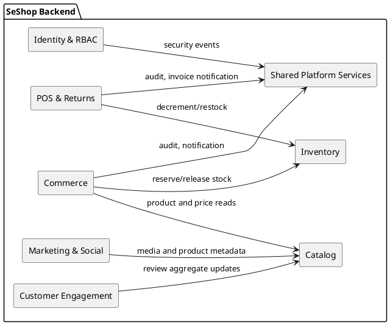
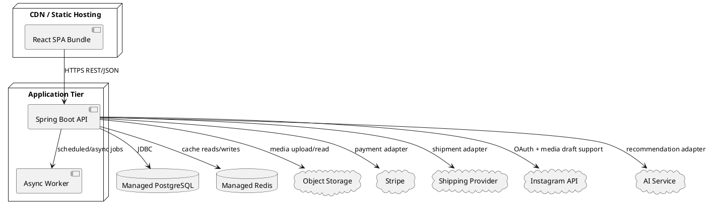

# SeShop - Architecture Design Document (ADD)

| Field | Value |
|---|---|
| Project | SeShop |
| Domain | Omnichannel clothing and accessories platform |
| Document Type | Architecture Design Document |
| Template Source | [Template/ADD.docx](../../Template/ADD.docx) |
| Version | 1.1 |
| Date | 2026-05-07 |

---

## Revision History

| Date | Version | Author | Description |
|---|---:|---|---|
| 2026-04-30 | 1.0 | Architecture Team | Initial ADD using iterative decomposition from ASR |
| 2026-05-07 | 1.1 | Architecture Team | Reformatted to match ADD.docx structure: design constraints, quality attribute requirements, and architectural representation |

---

## Table of Contents

1. [Design Constraints](#1-design-constraints)
2. [Quality Attribute Requirements](#2-quality-attribute-requirements)
   1. [Security](#21-security)
   2. [Performance](#22-performance)
   3. [Usability](#23-usability)
   4. [Interoperability](#24-interoperability)
   5. [Modifiability](#25-modifiability)
   6. [Availability](#26-availability)
3. [Architectural Representation](#3-architectural-representation)
   1. [Logical View](#31-logical-view)
   2. [Implementation View](#32-implementation-view)
   3. [Deployment View](#33-deployment-view)
   4. [Data View](#34-data-view)

---

# 1. Design Constraints

The following constraints define the allowed architecture space for SeShop. They are derived from the [BRD](../1.BRD/SESHOP%20BRD.md), [SRS](../10.SRS/SESHOP%20SRS.md), [ASR](SESHOP%20ASR.md), [API specification](SESHOP%20API%20Spec.md), and database schema.

- **Architecture style:** The backend is a modular monolith. Domain boundaries are enforced inside one deployable Spring Boot application instead of separate microservices.
- **Backend technology:** Java 21 and Spring Boot 3.3 are required.
- **Frontend technology:** React 18, TypeScript 5, and Vite are required.
- **Database technology:** PostgreSQL 15 is the transactional system of record.
- **Cache technology:** Redis may be used for hot catalog and availability reads, but it is not a source of truth.
- **API style:** External application communication uses REST/JSON over HTTPS under the `/api/v1` namespace.
- **Module isolation:** Backend modules must communicate through application service interfaces or domain events. A module must not directly access another module's owned tables.
- **Stock consistency:** Checkout, POS sale, refund, transfer, cycle count, goods receipt, and allocation operations must update stock inside a database transaction.
- **Availability calculation:** `available_qty` is computed as `on_hand_qty - reserved_qty`; it must not be stored as an independent column.
- **Payment scope:** Version 1 supports Stripe, Cash on Delivery, and in-store POS payment.
- **Social publishing scope:** Instagram support is compose-first. The system prepares and stores drafts but does not auto-publish without manual review.
- **Auditability:** Sensitive staff/admin and stock/money operations must create append-only audit records.
- **Localization:** Customer-facing and back-office interfaces must support Vietnamese and English text.
- **Migration management:** Database migrations are versioned and reviewed through Flyway-compatible scripts.

---

# 2. Quality Attribute Requirements

Each quality attribute requirement follows the ADD template format: stimulus, source, environment, artifact, response, and response measure.

## 2.1 Security

### 2.1.1 Authentication and Authorization

| **Element** | **Statement** |
|---|---|
| Stimulus | A user signs in or invokes an API endpoint that requires authentication and permission checks. |
| Stimulus source | Customer, Authorized Staff, or Super Admin. |
| Environment | Normal web operation through the React SPA or direct API access. |
| Artifact | Spring Security layer, Identity & RBAC module, JWT/session handling, permission catalog. |
| Response | The system authenticates the user, computes effective permissions from assigned active roles, enforces server-side authorization, returns `403 FORBIDDEN` for unauthorized actions, and records suspicious denied attempts. |
| Response measure | 100% of protected endpoints enforce authorization on the backend; unauthorized requests perform no side effects; permission checks add no more than 200 ms to normal request processing. |

### 2.1.2 Data Protection

| **Element** | **Statement** |
|---|---|
| Stimulus | Sensitive data is stored, transmitted, or used by an integration. |
| Stimulus source | Customers, staff users, payment gateway, Instagram OAuth flow, shipping provider, AI service. |
| Environment | Production runtime, backups, logs, and external API calls. |
| Artifact | PostgreSQL database, transport layer, external integration adapters, application logs. |
| Response | Passwords are stored as salted hashes; external tokens and secrets are encrypted at rest; all client and partner communication uses HTTPS/TLS; logs exclude plaintext secrets and payment tokens. |
| Response measure | Zero plaintext passwords or OAuth/payment secrets in database and logs; 100% external-facing endpoints require TLS; credential scan has no high-severity findings before release. |

### 2.1.3 Auditability

| **Element** | **Statement** |
|---|---|
| Stimulus | A sensitive operation changes access rights, stock, money, orders, refunds, POS shifts, invoices, Instagram connections, or audit-relevant configuration. |
| Stimulus source | Super Admin, Authorized Staff, or automated background process. |
| Environment | Normal business operation and compliance review. |
| Artifact | Audit subsystem and `audit_logs` table. |
| Response | The system creates an append-only audit record containing actor, action, target, timestamp, trace metadata, and before/after values when available. |
| Response measure | 100% coverage of sensitive operations; no application endpoint exposes audit UPDATE or DELETE behavior; audit records are searchable by actor, action, target, and date range. |

## 2.2 Performance

### 2.2.1 Product Search and Browsing

| **Element** | **Statement** |
|---|---|
| Stimulus | A customer searches, filters, sorts, or paginates the product catalog by category, size, color, price, or availability. |
| Stimulus source | Customer. |
| Environment | Normal daily load with concurrent browsing traffic. |
| Artifact | Catalog module, PostgreSQL indexes, optional Redis read-through cache, React storefront. |
| Response | The system returns a paginated product list with variant and availability information using indexed queries and cached hot reads where appropriate. |
| Response measure | 95th percentile response time is less than or equal to 2 seconds for normal product search and browse requests. |

### 2.2.2 Inventory Mutation Latency

| **Element** | **Statement** |
|---|---|
| Stimulus | Staff submits an inventory adjustment, transfer confirmation, POS stock decrement, checkout reservation, refund restock, cycle count posting, or goods receipt. |
| Stimulus source | Authorized Staff, Super Admin, Customer checkout, or background workflow. |
| Environment | Normal operations with concurrent stock-affecting actions. |
| Artifact | Inventory module, Commerce module, POS module, PostgreSQL `inventory_balances` table. |
| Response | The system validates the command, locks affected rows when required, commits the stock mutation atomically, and writes audit/domain-event records. |
| Response measure | Standard stock mutation commit latency is less than or equal to 500 ms; no stock mutation leaves partial state after failure. |

### 2.2.3 Scalability for Locations and SKUs

| **Element** | **Statement** |
|---|---|
| Stimulus | Business operations add new store/storage locations, product variants, or catalog categories. |
| Stimulus source | Authorized Staff or Super Admin. |
| Environment | Normal production operation without planned downtime. |
| Artifact | Catalog, Inventory, and PostgreSQL schema. |
| Response | New locations, SKUs, and category mappings are added as data records rather than schema changes. List endpoints remain paginated and indexed. |
| Response measure | Adding a location or SKU requires zero schema migrations; QAS product search and inventory latency targets remain satisfied after growth within expected v1 scale. |

## 2.3 Usability

### 2.3.1 Staff Operational Workflow

| **Element** | **Statement** |
|---|---|
| Stimulus | Trained staff perform routine POS, inventory, order fulfillment, refund, or social draft work. |
| Stimulus source | Authorized Staff. |
| Environment | Store or back-office workday with repeated task execution. |
| Artifact | Staff-facing React screens, API validation, workflow state models. |
| Response | The UI presents dense but scannable operational forms, immediate validation feedback, keyboard-friendly POS paths, and clear status transitions. |
| Response measure | A trained cashier can complete a 3-item POS sale in less than or equal to 60 seconds; common validation errors appear within 500 ms of field blur or submit. |

### 2.3.2 Customer Checkout Experience

| **Element** | **Statement** |
|---|---|
| Stimulus | A customer proceeds from cart to order confirmation. |
| Stimulus source | Customer. |
| Environment | Normal web use on desktop or mobile. |
| Artifact | Customer checkout UI, Commerce module, Payment adapter, Inventory reservation logic. |
| Response | The system guides the customer through shipping, discount, payment, and confirmation steps with no page reloads, clear error messages, and accurate stock/payment state. |
| Response measure | Checkout requires no more than 5 major steps; validation feedback appears within 500 ms; failed payment or insufficient stock produces no paid order. |

## 2.4 Interoperability

### 2.4.1 Third-Party System Integration

| **Element** | **Statement** |
|---|---|
| Stimulus | The platform sends requests to or receives callbacks from Stripe, shipping providers, Instagram, object storage, or an AI recommendation service. |
| Stimulus source | External service, customer checkout, staff workflow, or background job. |
| Environment | Normal operation and degraded partner availability. |
| Artifact | Infrastructure adapters, API clients, webhook/callback handlers. |
| Response | Integration calls use HTTPS, provider-specific authentication, bounded retries, timeouts, idempotency for money/stock effects, and clear error mapping into the API error model. |
| Response measure | External failure creates zero internal data corruption; users receive an actionable error within 5 seconds of timeout; provider swap changes are localized to adapter implementations. |

### 2.4.2 Internal Module Communication

| **Element** | **Statement** |
|---|---|
| Stimulus | One domain module requires data or side effects from another module, such as Commerce reserving stock or POS writing audit records. |
| Stimulus source | Backend application services and domain events. |
| Environment | Runtime inside the modular monolith. |
| Artifact | Application service interfaces, domain events, outbox/event dispatch mechanism. |
| Response | Synchronous in-process calls are used for command-critical results; asynchronous events are used for notifications, audit side effects, and eventual read updates. Modules do not bypass ownership by querying foreign tables directly. |
| Response measure | Cross-module business rule changes are limited to published interfaces/events; command-critical calls complete inside the request transaction when consistency is required. |

## 2.5 Modifiability

### 2.5.1 Business Requirement Changes

| **Element** | **Statement** |
|---|---|
| Stimulus | Product or operations stakeholders request a change to a business rule, such as discount policy, refund eligibility, stock allocation, or transfer approval. |
| Stimulus source | Business stakeholders and development team. |
| Environment | Development and maintenance. |
| Artifact | Backend domain modules, application services, React feature modules, API contract. |
| Response | The modular monolith confines the change to the relevant bounded context and its tests. Shared contracts are updated only when cross-module behavior must change. |
| Response measure | A single business rule change affects one primary backend module in the normal case; regression tests cover the changed module before release. |

### 2.5.2 External Integration Replacement and Testability

| **Element** | **Statement** |
|---|---|
| Stimulus | The team replaces a payment, shipping, Instagram, object storage, or AI provider, or needs to test domain behavior without real infrastructure. |
| Stimulus source | Business decision, vendor outage, QA/development team. |
| Environment | Development, CI, or production evolution. |
| Artifact | Ports and adapters, infrastructure clients, domain services, repository interfaces. |
| Response | Provider-specific logic is isolated behind adapter interfaces. Domain services depend on ports and can be tested with in-memory or mock implementations. |
| Response measure | Provider replacement requires zero domain-layer changes; domain/application test suites run without network access and without a shared test database. |

## 2.6 Availability

### 2.6.1 Fault Tolerance and System Recovery

| **Element** | **Statement** |
|---|---|
| Stimulus | An application instance, cache, external API, or non-primary component fails. |
| Stimulus source | Infrastructure fault, software defect, network issue, or partner outage. |
| Environment | Production runtime. |
| Artifact | Spring Boot API, PostgreSQL, Redis, object storage, external adapters, health probes, backups. |
| Response | Critical data remains in PostgreSQL; stateless API instances can be restarted or scaled; degraded integrations fail gracefully; health checks expose service status; backups support recovery. |
| Response measure | Core commerce target is 99.9% monthly availability; recovery procedures keep data loss within approved backup policy; Redis failure does not lose committed business state. |

### 2.6.2 Automated Payment, Shipping, and Reservation Handling

| **Element** | **Statement** |
|---|---|
| Stimulus | The system receives payment/shipping callbacks or detects expired reservations and failed external operations. |
| Stimulus source | Stripe, shipping provider, scheduled reservation cleanup, customer retry. |
| Environment | After checkout, refund, fulfillment, or retryable failure. |
| Artifact | Commerce module, Payment adapter, Shipment workflow, Inventory reservation records, background workers. |
| Response | Callback handlers validate authenticity and idempotency, update payment/shipment/order status, release expired reservations, and notify users or staff when action is required. |
| Response measure | Duplicate callbacks do not duplicate payments or shipments; expired reservations are released by scheduled cleanup; failed external operations leave no orphaned paid or allocated order state. |

---

# 3. Architectural Representation

The SeShop architecture is represented through four complementary views: logical, implementation, deployment, and data. The detailed SAD expands these views using the Views-and-Beyond documentation style.

## 3.1 Logical View

The logical view decomposes SeShop into business-aligned bounded contexts. Each context owns its rules, tables, and public application interfaces.

| Subsystem | Responsibility |
|---|---|
| Identity & RBAC | Authentication, users, roles, permissions, effective access, audit identity. |
| Catalog | Products, variants/SKUs, categories, product images, catalog publishing state. |
| Inventory | Locations, balances, transfers, cycle counts, procurement receiving, stock reservations. |
| Commerce | Cart, online orders, payments, discounts, shipment orchestration, checkout lifecycle. |
| POS & Returns | POS shifts, receipts, cash reconciliation, refunds, exchanges, invoices, adjustment notes. |
| Marketing & Social | Instagram connection lifecycle, compose-ready draft generation, review/publish handoff. |
| Customer Engagement | Reviews and AI recommendation interactions. |
| Shared Platform Services | Audit dispatch, notifications, file storage, exception handling, configuration, utilities. |



## 3.2 Implementation View

The implementation view maps logical modules to code organization. Each backend module follows hexagonal architecture so domain logic remains independent from web, database, and integration details.

```text
com.seshop
├── identity/
│   ├── api/
│   ├── application/
│   ├── domain/
│   └── infrastructure/
├── catalog/
├── inventory/
├── commerce/
├── pos/
├── marketing/
├── engagement/
└── shared/
    ├── security/
    ├── audit/
    ├── exception/
    ├── config/
    └── util/
```

| Layer | Contents | Dependency Rule |
|---|---|---|
| `api` | Controllers, DTOs, request validation, HTTP mapping | Depends on `application` only. |
| `application` | Use cases, transactions, commands, queries, orchestration | Depends on `domain` ports and services. |
| `domain` | Entities, value objects, domain services, policies, port interfaces | No dependency on framework or persistence code. |
| `infrastructure` | JPA repositories, external clients, cache adapters, storage adapters | Implements interfaces defined by `domain` or `application`. |

**Dependency direction:** `api -> application -> domain <- infrastructure`

## 3.3 Deployment View

SeShop deploys as a React SPA plus one or more stateless Spring Boot API instances backed by PostgreSQL, Redis, object storage, and approved external providers.



| Environment | Purpose | Notes |
|---|---|---|
| Development | Local implementation and feature testing | Docker Compose may provide PostgreSQL and Redis. |
| Staging/UAT | Acceptance validation before release | Same architecture shape as production with controlled test data. |
| Production | Live customer and staff operation | Managed database/cache/storage, monitored API instances, reviewed migrations. |

## 3.4 Data View

The data view is organized around table ownership. PostgreSQL is the source of truth, and each module owns a defined subset of tables.

| Module | Owned Tables |
|---|---|
| Identity & RBAC | `users`, `roles`, `permissions`, `role_permissions`, `user_roles`, `audit_logs` |
| Catalog | `categories`, `products`, `product_categories`, `product_variants`, `product_images` |
| Inventory | `locations`, `inventory_balances`, `inventory_transfers`, `inventory_transfer_items`, `cycle_counts`, `cycle_count_items`, `suppliers`, `purchase_orders`, `purchase_order_items`, `goods_receipts`, `goods_receipt_items` |
| Commerce | `carts`, `cart_items`, `orders`, `order_items`, `order_allocations`, `shipments`, `payments`, `discount_codes`, `discount_redemptions` |
| POS & Returns | `pos_shifts`, `pos_receipts`, `pos_receipt_items`, `cash_reconciliations`, `return_requests`, `return_items`, `refunds`, `exchanges`, `tax_invoices`, `invoice_adjustment_notes` |
| Marketing & Social | `instagram_connections`, `instagram_drafts` |
| Customer Engagement | `reviews` |

Data rules:

- Tables have one owning module.
- Cross-module reads and writes go through application services, not direct table access.
- Stock-affecting commands use transaction boundaries and row locks where required.
- Business identifiers such as `orderNumber`, `skuCode`, `poNumber`, and `invoiceNumber` are exposed for user-facing workflows while numeric IDs remain internal identifiers.
- Media files are stored in object storage; PostgreSQL stores metadata and URLs.
