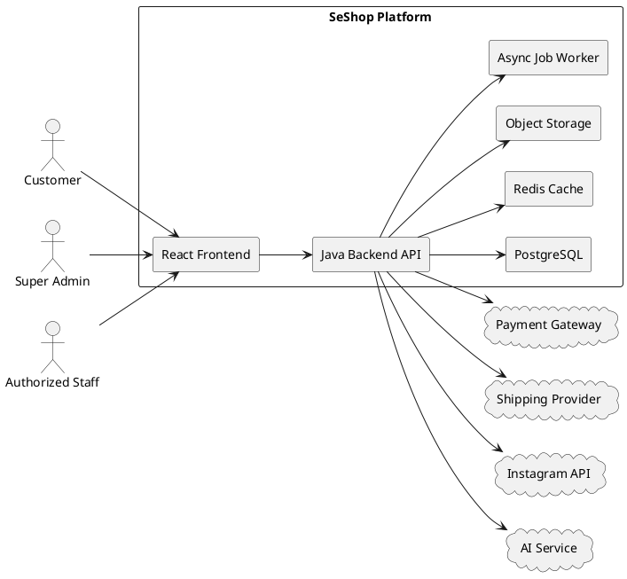

# SE SHOP HIGH-LEVEL DESIGN (HLD)

**Project:** SeShop  
**Domain:** Omnichannel clothing & accessories platform  
**Architecture style:** Modular Monolith  
**Backend:** Java + Spring Boot  
**Frontend:** React + TypeScript  
**Database:** PostgreSQL  
**Last updated:** 2026-04-28

---

## Revision History

| Date | Version | Author | Description |
|---|---:|---|---|
| 2026-04-28 | 1.0 | GitHub Copilot | Initial HLD covering the full SeShop platform based on BRD, SRS, views, and database design |

---

## Table of Contents

1. [References](#references)
2. [Purpose and Scope](#purpose-and-scope)
3. [Business and Architecture Goals](#business-and-architecture-goals)
4. [Architecture Drivers](#architecture-drivers)
5. [System Boundary](#system-boundary)
6. [High-Level Architecture Decision](#high-level-architecture-decision)
7. [Container Architecture](#container-architecture)
8. [Domain Decomposition](#domain-decomposition)
9. [Backend Architecture](#backend-architecture)
10. [Frontend Architecture](#frontend-architecture)
11. [Data Architecture](#data-architecture)
12. [Integration Architecture](#integration-architecture)
13. [Security Architecture](#security-architecture)
14. [Performance, Scalability, and Reliability](#performance-scalability-and-reliability)
15. [Observability and Operations](#observability-and-operations)
16. [Deployment View](#deployment-view)
17. [Key Architectural Flows](#key-architectural-flows)
18. [Trade-offs and Alternatives](#trade-offs-and-alternatives)
19. [Risks and Mitigations](#risks-and-mitigations)
20. [Conclusion](#conclusion)

---

## References

This HLD derives scope and requirements from:

- [docs/1.BRD/SESHOP BRD.md](../1.BRD/SESHOP%20BRD.md)
- [docs/10.SRS/SESHOP SRS.md](../10.SRS/SESHOP%20SRS.md)
- [docs/4. View descriptions/SeShop Views Desc.md](../4.%20View%20descriptions/SeShop%20Views%20Desc.md)
- [docs/5.Database/SESHOP schema.sql](../5.Database/SESHOP%20schema.sql)

---

## Purpose and Scope

This HLD describes the architecture of the entire SeShop platform at a level suitable for technical planning, implementation alignment, QA strategy, and deployment sizing.

### Goals
- Support omnichannel commerce from a single platform.
- Keep online and offline stock synchronized at SKU-location level.
- Provide configurable RBAC for staff operations.
- Support operational workflows: inventory transfer, receiving, POS, refunds, invoices, and returns.
- Support storefront browsing, checkout, shipment tracking, reviews, and AI recommendations.
- Support social marketing workflows via Instagram drafts and account connectivity.

### Non-goals
- Defining every class and method.
- Defining every API request/response field.
- Microservice split planning.
- Infrastructure-as-code implementation details.

---

## Business and Architecture Goals

The architecture is optimized for the following business outcomes:

1. **Single source of truth for stock** across stores and storage locations.
2. **Reduce overselling** by reserving and validating inventory at commit time.
3. **Fast staff operations** for POS, transfer, receiving, and return workflows.
4. **Secure governance** through RBAC and immutable audit logs.
5. **Better conversion** through product discovery, location availability, and AI recommendations.
6. **Operational marketing efficiency** through reusable Instagram draft workflows.
7. **Maintainability** through modular structure and clear ownership boundaries.

---

## Architecture Drivers

### Functional Drivers
- Customer browsing, cart, checkout, payment, shipping, review.
- Admin and staff operations for inventory, catalog, POS, transfers, refunds, and invoices.
- Instagram draft generation and account connection.
- AI recommendation assistant.

### Quality Attribute Drivers

| Quality Attribute | Driver |
|---|---|
| Modifiability | Business rules change often across promotions, inventory, and fulfillment. |
| Security | Staff permissions and financial data must be tightly controlled. |
| Performance | Catalog browsing and stock lookup must remain responsive. |
| Reliability | Checkout, POS, and inventory operations must be consistent. |
| Testability | Domain logic must be isolated and verifiable. |
| Operability | Audit, logs, metrics, and tracing are mandatory. |
| Usability | Customer and staff UI must be clear and fast. |

---

## System Boundary

### External Actors
- Customer
- Super Admin
- Authorized Staff
- Payment Gateway
- Shipping Provider
- Instagram Platform / API
- AI Recommendation Service

### Internal System Responsibilities
- Authentication and authorization
- Business rules enforcement
- Inventory synchronization
- Order orchestration
- Media and draft management
- Notifications and audit trail

### Boundary Principle
Everything that changes business state must pass through the backend domain layer. The frontend must never be the source of truth for inventory, order state, or access control.

---

## High-Level Architecture Decision

### Chosen Style: Modular Monolith

SeShop should use one deployable backend application, internally divided into modules by business capability.

### Why this is the best fit
- The project has many domains, but they are strongly related.
- Cross-domain transactions are common: checkout touches cart, order, payment, inventory, shipment, notifications, and audit.
- A modular monolith reduces network complexity and operational overhead.
- The team can later extract modules if scale or organizational needs justify it.

### Why not microservices now
- Too much orchestration overhead for a single-business system.
- Distributed transactions would complicate checkout and inventory correctness.
- Increased deployment, monitoring, and incident burden.

### Architectural Pattern Stack
- **Modular Monolith** at system level
- **Hexagonal Architecture** at module level
- **DDD-lite** for boundaries and language
- **Repository pattern** for persistence abstraction
- **Strategy** for pricing, promotion, allocation, payment, and recommendation policies
- **State** for order, transfer, refund, shift, and draft lifecycles
- **Adapter** for external integrations
- **Domain events** for internal propagation of stock and status changes

---

## Container Architecture

### C4-style Container View

### Container Responsibilities

| Container | Responsibility |
|---|---|
| React Frontend | User interface for customer, staff, and admin workflows. |
| Java Backend API | Main business logic, security, orchestration, and data access. |
| PostgreSQL | System of record for all business data. |
| Redis Cache | Fast read paths for catalog, location availability, and sessions/rate-limited data. |
| Object Storage | Product images, review images, and generated media renditions. |
| Async Job Worker | Email/sms notifications, media processing, report generation, synchronization tasks. |

---

## Domain Decomposition

The backend should be split into the following bounded contexts.

### 1. Identity & RBAC
- Users
- Roles
- Permissions
- User-role assignment
- Audit logs

### 2. Catalog
- Products
- Variants / SKUs
- Categories
- Product images
- Publish status

### 3. Inventory
- Locations
- Inventory balances
- Transfers
- Cycle counts
- Procurement receiving

### 4. Commerce
- Carts
- Orders
- Order items
- Allocation
- Payments
- Shipments
- Discount codes

### 5. POS & Returns
- POS shift
- POS receipts
- Cash reconciliation
- Return requests
- Refunds
- Exchanges
- Tax invoices
- Adjustment notes

### 6. Marketing & Social
- Instagram connections
- Instagram drafts
- Marketing content composition

### 7. Customer Engagement
- Reviews
- AI recommendation chat
- Stock availability display

### 8. Shared Platform Services
- Audit event handling
- Notification dispatch
- File/media storage
- Localization
- Idempotency and validation utilities

---

## Backend Architecture

### Logical Layers
Each module should follow these layers:

1. **API Layer**
   - REST controllers
   - request validation
   - response mapping
   - authentication/authorization guards

2. **Application Layer**
   - use-case orchestration
   - transaction handling
   - command handlers
   - query handlers

3. **Domain Layer**
   - entities
   - value objects
   - domain services
   - business rules
   - state transitions

4. **Infrastructure Layer**
   - repositories
   - external API clients
   - messaging adapters
   - file storage adapters
   - cache adapters

### Suggested Java Stack
- Java 21
- Spring Boot
- Spring Web
- Spring Validation
- Spring Security
- Spring Data JPA
- Flyway
- Redis client
- OpenAPI for API documentation
- MapStruct for DTO mapping
- Testcontainers for integration testing

### Backend Module Interaction Rules
- Modules communicate through application services and domain events, not direct table sharing.
- Shared entities such as user, location, and product reference are owned by one module and consumed by others via read models or service interfaces.
- Inventory changes must be atomic and validated in the inventory module before downstream notifications or UI refresh.

### Transaction Boundaries
Use ACID transactions for:
- checkout order creation
- payment confirmation
- POS sale completion
- transfer confirmation
- refund processing
- cycle count posting
- invoice issuance

### Internal Event Examples
- `OrderPaid`
- `StockReserved`
- `StockReleased`
- `POSSaleCompleted`
- `RefundCompleted`
- `InventoryTransferCompleted`
- `ReviewApproved`
- `InstagramDraftReady`

---

## Frontend Architecture

### Frontend Style
Use a **React + TypeScript feature-based architecture**.

### Recommended Frontend Structure
- `app/` – app bootstrap, routing, providers
- `pages/` – route-level screens
- `widgets/` – reusable page sections
- `features/` – business interactions such as checkout, role edit, transfer creation
- `entities/` – product, order, user, inventory, role, location models
- `shared/` – UI kit, utilities, hooks, constants, API client

### Frontend Patterns
- **Container/Presentational separation** for reuse and clarity
- **Custom hooks** for business workflows
- **Server-state management** with TanStack Query
- **Form state management** with React Hook Form
- **Schema validation** with Zod
- **Error boundaries** for route-level resilience
- **Design system** for consistent omnichannel UI

### Frontend Responsibilities
- Render role-specific screens for admin, staff, and customers
- Manage view state and local interactions
- Call backend APIs
- Never enforce business rules that must be authoritative on server
- Display localization and structured errors

### UX Notes
- Staff workflows should be optimized for keyboard efficiency and dense tables.
- Customer storefront should be responsive and mobile-first.
- Product detail pages must show variant availability and location stock context.
- Checkout must be low-friction, with immediate validation feedback.

---

## Data Architecture

### Source of Truth
PostgreSQL is the source of truth for all transactional business data.

### Major Aggregate Areas
- User / Role / Permission
- Product / Variant / Image
- Location / InventoryBalance / Transfer
- Cart / Order / Payment / Shipment
- POS Shift / Receipt / Cash Reconciliation
- Return / Refund / Exchange
- Instagram Connection / Draft
- Review

### Data Modeling Principles
- Use normalized tables for transactional integrity.
- Store stock at SKU-location level.
- Keep audit logs append-only.
- Use unique constraints for identity, SKU codes, location codes, order numbers, etc.
- Avoid derived values as persistent fields unless they are required for performance or reporting.

### Read Optimization
- Use indexes for common access paths such as customer orders, inventory lookup, shipments, payments, and audit logs.
- Use Redis for hot reads such as catalog browsing and stock availability if necessary.
- Build read models or denormalized query projections for dashboard screens.

### Media Storage
- Product images, review images, and generated Instagram-ready media should be stored in object storage.
- The database stores metadata and references, not binary blobs.

### Key Database Groups
| Group | Examples |
|---|---|
| Identity | users, roles, permissions, role_permissions, user_roles, audit_logs |
| Catalog | categories, products, product_categories, product_variants, product_images |
| Inventory | locations, inventory_balances, inventory_transfers, inventory_transfer_items, cycle_counts |
| Procurement | suppliers, purchase_orders, purchase_order_items, goods_receipts, goods_receipt_items |
| Commerce | carts, cart_items, orders, order_items, order_allocations, shipments, payments, discount_codes, discount_redemptions |
| Reverse Logistics | return_requests, return_items, refunds, exchanges |
| POS & Finance | pos_shifts, pos_receipts, pos_receipt_items, cash_reconciliations, tax_invoices, invoice_adjustment_notes |
| Social & Engagement | instagram_connections, instagram_drafts, reviews |

---

## Integration Architecture

### External Integrations

| Integration | Purpose | Pattern |
|---|---|---|
| Payment Gateway | Online payment capture and status confirmation | Adapter + Strategy |
| Shipping Provider | Shipment creation and tracking updates | Adapter + Webhook handler |
| Instagram Platform | Social account connection and draft workflow support | OAuth Adapter |
| AI Service | Product recommendation responses | Adapter + Policy layer |
| Email/SMS Provider | Notifications and verification | Adapter |

### Integration Rules
- All external APIs must be isolated behind adapters.
- Retry logic must be bounded and idempotent.
- Payment and shipment callbacks must be verified and reconciled.
- Sensitive tokens must be encrypted at rest.

### API Style
- REST is the primary integration style.
- Use versioned endpoints such as `/api/v1/...`.
- Support idempotency keys for checkout, payment, refund, and transfer confirmation.
- Use pagination and filters for all list endpoints.

---

## Security Architecture

### Authentication
- Customer and staff authentication through secure token-based login.
- Passwords stored as salted hashes.
- Session/token lifecycle must support revocation.

### Authorization
- RBAC is permission-driven, not role-name-driven.
- Use least privilege by default.
- Sensitive operations require explicit permissions.

### Security Controls
- Input validation on all API endpoints.
- CSRF protection if cookie-based auth is used.
- Rate limiting on login and public endpoints.
- Audit logging for all sensitive changes.
- Encrypt secrets and external tokens.
- Strict file upload validation for media and review images.

### Sensitive Actions to Audit
- Role creation and permission assignment
- Role assignment and revocation
- Inventory adjustments and transfers
- Payment confirmation and refund processing
- POS close and cash reconciliation
- Instagram connection changes
- Tax invoice issuance
- Admin configuration updates

---

## Performance, Scalability, and Reliability

### Performance Targets
- Product browsing and filtering should remain fast under seasonal traffic.
- Inventory lookup should be near real-time for customer-facing stock availability.
- Checkout and POS flows should complete without unnecessary round trips.

### Scalability Approach
- Scale horizontally at the application layer.
- Cache read-heavy catalog and location data.
- Keep write-heavy transactional flows in PostgreSQL with good indexing.
- Use asynchronous workers for non-critical background tasks.

### Reliability Approach
- Use database transactions for critical state changes.
- Use idempotency keys on operations that may be retried.
- Use an outbox/event publication pattern for reliable side effects.
- Degrade gracefully when external systems are unavailable.

### Concurrency Considerations
- Inventory reservation and release must be concurrency-safe.
- Transfer, checkout, and POS operations must prevent oversell.
- Refund and return flows must verify original transaction state.

---

## Observability and Operations

### Logging
- Structured application logs.
- Correlation IDs per request.
- Separate business audit logs from technical logs.

### Metrics
- Order completion rate
- Checkout success/failure rate
- Inventory adjustment count
- Transfer completion time
- POS close variance count
- Payment latency
- External API error rate

### Tracing
- Trace checkout, payment, allocation, shipment, refund, and POS workflows end to end.

### Operational Requirements
- Backup and restore procedures for PostgreSQL.
- Regular schema migration control.
- Media storage lifecycle management.
- Maintenance windows with rollback capability.

---

## Deployment View

### Recommended Deployment Topology
- **Frontend:** static hosting or CDN-backed web hosting
- **Backend API:** one Java application deployment, scaled horizontally
- **Worker:** separate worker process or scheduled job runner
- **PostgreSQL:** managed relational database
- **Redis:** managed cache service
- **Object storage:** managed blob storage

### Environments
- Development
- Staging/UAT
- Production

### Deployment Principles
- Same architecture across environments.
- Feature flags for risky capabilities if needed.
- Database migration scripts versioned and reviewed.
- Secrets managed outside source control.

---

## Key Architectural Flows

### 1. Customer Checkout
1. Customer adds SKU to cart.
2. Frontend sends checkout request.
3. Backend validates cart, price, discount, and stock reservation.
4. Payment is processed through adapter.
5. Order is created.
6. Stock is confirmed or reserved/released.
7. Notification is sent.

### 2. Inventory Transfer
1. Staff creates transfer draft.
2. Source availability is validated.
3. Stock is reserved or decremented according to policy.
4. Transfer status becomes in transit.
5. On confirmation, destination stock is increased.
6. Audit log is written.

### 3. POS Sale
1. Cashier builds basket.
2. Payment is confirmed.
3. POS receipt is created.
4. Location stock is decremented atomically.
5. Shift metrics are updated.
6. Receipt and audit information are stored.

### 4. Refund / Return
1. Staff opens original transaction.
2. Eligibility is checked.
3. Return request is created.
4. Item is inspected.
5. Refund and/or exchange is processed.
6. Stock disposition is applied.
7. Audit trail is written.

### 5. Instagram Draft
1. Staff selects product media.
2. System suggests caption and hashtags.
3. Draft is edited and saved.
4. Review/approval is completed.
5. Manual publish handoff is prepared.

---

## Trade-offs and Alternatives

### Alternative 1: Microservices
**Rejected for now** because it adds unnecessary operational complexity and makes consistency harder across checkout, inventory, and POS.

### Alternative 2: Frontend SSR-first
**Not required initially**. React SPA is simpler for staff-heavy back-office flows. SSR can be introduced later if SEO or performance requires it.

### Alternative 3: Event-driven full architecture
**Not required initially**. Internal domain events are enough to support decoupling without adopting distributed systems complexity.

### Alternative 4: Multiple databases per module
**Not required initially**. One PostgreSQL system of record is simpler and better aligned with a modular monolith.

---

## Risks and Mitigations

| Risk | Impact | Mitigation |
|---|---|---|
| Oversell under concurrency | High | Atomic reservation, locking strategy, idempotent checkout |
| External API failure | Medium | Retry, timeout, fallback, reconciliation jobs |
| Complex business logic growth | High | Enforce module boundaries and domain services |
| Permission sprawl | Medium | Central permission catalog and review process |
| Media storage growth | Medium | Object storage lifecycle and thumbnail generation |
| Frontend complexity | Medium | Feature-based structure and design system |
| Audit gaps | High | Mandatory audit logging for sensitive operations |

---

## Conclusion

The recommended architecture for SeShop is a **Java-based modular monolith** with **React frontend**, designed around business domains rather than technical layers. This approach fits the project’s single-business omnichannel scope, preserves strong consistency for inventory and commerce, and keeps the platform maintainable without microservice overhead.

This HLD is aligned with the BRD, SRS, views, and database design already present in the repository. It should serve as the baseline for LLD, API specification, implementation planning, and test design.
