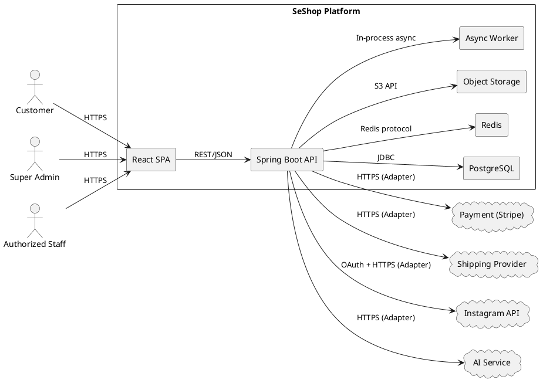
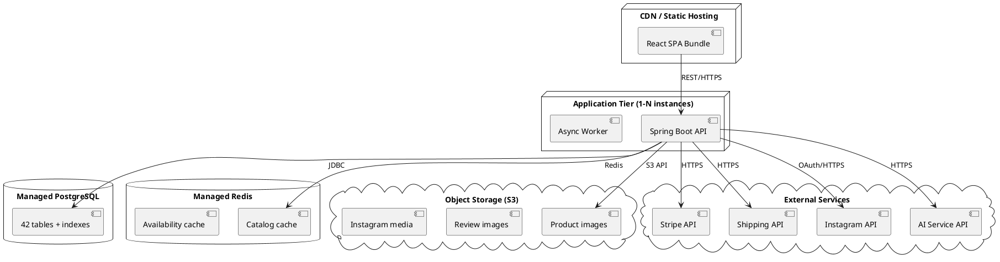

# SeShop — Software Architecture Document (SAD)

**Project:** SeShop
**Domain:** Omnichannel clothing & accessories platform
**Standard:** SEI / Carnegie Mellon — Views and Beyond (V&B) Approach
**Version:** 1.0
**Date:** 2026-04-30

---

## Revision History

| Date | Version | Author | Description |
|---|---:|---|---|
| 2026-04-30 | 1.0 | Architecture Team | Initial SAD using Views and Beyond framework |

---

## Table of Contents

1. [Documentation Roadmap](#1-documentation-roadmap)
2. [Architecture Background](#2-architecture-background)
3. [Module View](#3-module-view)
4. [Component and Connector View](#4-component-and-connector-view)
5. [Deployment View](#5-deployment-view)
6. [Relations Among Views](#6-relations-among-views)
7. [Cross-Cutting Documentation](#7-cross-cutting-documentation)
8. [Architecture Rationale](#8-architecture-rationale)

---

## 1. Documentation Roadmap

### 1.1 How to Read This Document

This SAD describes the SeShop architecture through three complementary **viewpoints** as prescribed by the SEI Views and Beyond approach:

| View | What It Shows | Audience |
|---|---|---|
| **Module View** | Static code decomposition — packages, modules, layers, dependencies | Developers, tech leads |
| **Component & Connector View** | Runtime elements — processes, data flows, domain events, external integrations | Architects, DevOps, QA |
| **Deployment View** | Infrastructure mapping — where code runs, containers, environments | DevOps, operations, infrastructure |

Each view is presented with:
- **Primary presentation** — a diagram showing the view's elements and relationships
- **Element catalog** — brief description of each element shown
- **Behavior documentation** — key runtime flows
- **Variability & rationale** — design choices and alternatives

### 1.2 Relationship to Other Documents

This SAD does **not** duplicate content from other project documents. Instead, it references them:

| Document | Relationship to SAD |
|---|---|
| [SESHOP ASR](SESHOP%20ASR.md) | Defines the quality attribute scenarios this architecture addresses |
| [SESHOP ADD](SESHOP%20ADD.md) | Records the iterative design process that produced this architecture |
| [SESHOP HLD](SESHOP%20HLD.md) | Provides detailed architecture description (container, domain, integration, security) |
| [SESHOP LLD](SESHOP%20LLD.md) | Provides detailed design per module (entities, APIs, state machines, validation) |
| [SESHOP API Spec](SESHOP%20API%20Spec.md) | Defines the REST API contract |
| [SESHOP schema.sql](../5.Database/SESHOP%20schema.sql) | Database schema — system of record |
| [SESHOP Data Dictionary](../5.Database/SESHOP%20Data%20Dictionary.md) | Table-level semantics |
| [SeShop Views Desc](../4.%20View%20descriptions/SeShop%20Views%20Desc.md) | UI view specifications for all 25 screens |

---

## 2. Architecture Background

### 2.1 Problem Context

SeShop is an omnichannel clothing and accessories retail platform that unifies online e-commerce and physical store operations under a single system. The core challenge is maintaining **a single source of truth for inventory** across multiple physical locations while supporting concurrent operations from both online customers and in-store staff.

The full business context is defined in [BRD Section 3](../1.BRD/SESHOP%20BRD.md).

### 2.2 System Scope

The system supports three primary actor classes:
- **Customer** — browsing, checkout, tracking, reviews, AI chat
- **Authorized Staff** — inventory, POS, orders, returns, discounts, social marketing
- **Super Admin** — RBAC, audit, system configuration

Across **27 use cases** (UC1–UC27) as defined in the [SRS](../10.SRS/SESHOP%20SRS.md).

### 2.3 Quality Attribute Requirements Summary

The architecturally significant requirements (ASRs) that shape this architecture are documented in [SESHOP ASR.md](SESHOP%20ASR.md). The three **Critical** ASRs are:

| ID | Scenario | Target |
|---|---|---|
| QAS-3 | Checkout consistency under concurrency | Zero oversell events |
| QAS-5 | RBAC enforcement | 100% server-side enforcement |
| QAS-7 | Immutable audit trail | 100% coverage of sensitive operations |

### 2.4 Architectural Approach

**Modular Monolith** was chosen as the system-level architecture style. The rationale is documented in [ADD Iteration 1](SESHOP%20ADD.md) and [HLD Sections 6–7](SESHOP%20HLD.md).

---

## 3. Module View

### 3.1 Viewpoint

The Module View shows the **static code structure** — how source code is organized into modules, packages, and layers. It uses the **decomposition style** (modules contain sub-modules) and the **layered style** (dependencies flow in one direction).

### 3.2 Primary Presentation — Module Decomposition

```
com.seshop
├── identity/           ← Module 1: Identity & RBAC
│   ├── api/
│   ├── application/
│   ├── domain/
│   └── infrastructure/
│
├── catalog/            ← Module 2: Catalog
│   ├── api/
│   ├── application/
│   ├── domain/
│   └── infrastructure/
│
├── inventory/          ← Module 3: Inventory
│   ├── api/
│   ├── application/
│   ├── domain/
│   └── infrastructure/
│
├── commerce/           ← Module 4: Commerce
│   ├── api/
│   ├── application/
│   ├── domain/
│   └── infrastructure/
│
├── pos/                ← Module 5: POS & Returns
│   ├── api/
│   ├── application/
│   ├── domain/
│   └── infrastructure/
│
├── marketing/          ← Module 6: Marketing & Social
│   ├── api/
│   ├── application/
│   ├── domain/
│   └── infrastructure/
│
├── engagement/         ← Module 7: Customer Engagement
│   ├── api/
│   ├── application/
│   ├── domain/
│   └── infrastructure/
│
└── shared/             ← Module 8: Shared Platform Services
    ├── security/
    ├── audit/
    ├── exception/
    ├── config/
    └── util/
```

### 3.3 Element Catalog — Domain Modules

| Module | Bounded Context | Key Entities | Owned Tables | Use Cases |
|---|---|---|---|---|
| `identity` | Identity & RBAC | User, Role, Permission, AuditLog | `users`, `roles`, `permissions`, `role_permissions`, `user_roles`, `audit_logs` | UC1–UC4 |
| `catalog` | Catalog | Product, ProductVariant, Category, ProductImage | `products`, `product_variants`, `product_categories`, `product_images`, `categories` | UC5, UC13 |
| `inventory` | Inventory | Location, InventoryBalance, Transfer, CycleCount, PurchaseOrder, GoodsReceipt | `locations`, `inventory_balances`, `inventory_transfers`, `inventory_transfer_items`, `cycle_counts`, `cycle_count_items`, `suppliers`, `purchase_orders`, `purchase_order_items`, `goods_receipts`, `goods_receipt_items` | UC6, UC7, UC16, UC22, UC23, UC25 |
| `commerce` | Commerce | Cart, Order, Payment, Shipment, DiscountCode | `carts`, `cart_items`, `orders`, `order_items`, `order_allocations`, `shipments`, `payments`, `discount_codes`, `discount_redemptions` | UC10, UC12, UC13, UC15, UC17, UC19, UC20 |
| `pos` | POS & Returns | POSShift, POSReceipt, CashReconciliation, ReturnRequest, Refund, Exchange, TaxInvoice | `pos_shifts`, `pos_receipts`, `pos_receipt_items`, `cash_reconciliations`, `return_requests`, `return_items`, `refunds`, `exchanges`, `tax_invoices`, `invoice_adjustment_notes` | UC8, UC9, UC24, UC26, UC27 |
| `marketing` | Marketing & Social | InstagramConnection, InstagramDraft | `instagram_connections`, `instagram_drafts` | UC11, UC21 |
| `engagement` | Customer Engagement | Review | `reviews` | UC14, UC18 |
| `shared` | Platform Services | AuditLog, Notification, FileStorage | (cross-cutting) | Supporting all modules |

### 3.4 Element Catalog — Internal Layers

Each module follows the Hexagonal Architecture pattern (see [ADD Iteration 5](SESHOP%20ADD.md)):

| Layer | Contents | Depends On | Depended On By |
|---|---|---|---|
| `api` | REST controllers, request/response DTOs, mappers, auth guards | `application` | External HTTP clients |
| `application` | Use case orchestration, commands, queries, transaction management | `domain` | `api` |
| `domain` | Entities, value objects, domain services, business rules, state transitions, port interfaces | Nothing | `application`, `infrastructure` |
| `infrastructure` | JPA entities, repository implementations, external API clients, cache adapters, file adapters | `domain` (implements ports) | Nothing directly |

**Dependency Rule:** `api` → `application` → `domain` ← `infrastructure`

The `domain` layer defines interfaces (ports) that `infrastructure` implements (adapters). This enables domain logic to be tested in isolation (addressing QAS-13).

### 3.5 Module Dependency Rules

```
┌────────────┐    service interface    ┌──────────┐
│  commerce  │ ──────────────────────→ │ inventory │
│  (checkout │     reads via           │ (stock   │
│   needs    │     published ports     │  query)  │
│   stock)   │                         └──────────┘
└────────────┘
       │ publishes
       │ OrderPaid event
       ↓
┌────────────┐
│   shared   │ → audit log, notification dispatch
└────────────┘
```

Detailed module interactions and rules are defined in [HLD Section 9](SESHOP%20HLD.md) (Backend Module Interaction Rules).

### 3.6 Frontend Module Structure

```
src/
├── pages/          ← Route-level screens (customer, staff, admin)
├── components/     ← Feature-grouped UI components
│   ├── auth/       ├── catalog/     ├── cart/
│   ├── checkout/   ├── customer/    ├── admin/
│   ├── staff/      ├── instagram/   └── common/
├── hooks/          ← Business workflow hooks
├── context/        ← Auth, Cart, Notification, Theme providers
├── services/api/   ← API client layer (one file per domain)
├── store/          ← State management (Redux/Zustand)
├── types/          ← TypeScript type definitions
└── utils/          ← Formatters, validators, constants
```

Detailed frontend structure in [frontend/README.md](../../frontend/README.md).

---

## 4. Component and Connector View

### 4.1 Viewpoint

The Component and Connector (C&C) View shows the **runtime architecture** — processes, their interactions, data flows, and communication protocols.

### 4.2 Primary Presentation — System Context



This diagram is consistent with [HLD Section 7](SESHOP%20HLD.md) (Container Architecture).

### 4.3 Element Catalog — Runtime Components

| Component | Process Type | Technology | Responsibility |
|---|---|---|---|
| React SPA | Browser process | React 18 + TypeScript | Renders customer, staff, and admin interfaces; manages view state; calls backend APIs |
| Spring Boot API | Server process (1–N instances) | Java 21, Spring Boot 3.3 | Business logic execution, security enforcement, data access, external integration |
| PostgreSQL | Database process | PostgreSQL 15 | System of record for all 42 tables |
| Redis | Cache process | Redis | Read-through cache for catalog, availability, session/rate-limiting data |
| Object Storage | Storage service | S3-compatible | Product images, review images, Instagram media |
| Async Worker | Background threads | Spring @Async, @Scheduled | Email/SMS notifications, media processing, reservation cleanup, report generation |

### 4.4 Connectors

| Connector | From → To | Protocol | Style |
|---|---|---|---|
| Client–API | React SPA → Spring Boot API | HTTPS, REST/JSON | Synchronous request-response |
| API–Database | Spring Boot API → PostgreSQL | JDBC over TCP | Synchronous, connection-pooled |
| API–Cache | Spring Boot API → Redis | Redis protocol | Synchronous read; async invalidation |
| API–Storage | Spring Boot API → Object Storage | S3 HTTPS | Synchronous upload; async processing |
| API–Payment | Spring Boot API → Stripe | HTTPS via Adapter | Synchronous charge/refund |
| API–Shipping | Spring Boot API → Shipping Provider | HTTPS via Adapter | Synchronous create; webhook for status updates |
| API–Instagram | Spring Boot API → Instagram API | OAuth2 + HTTPS | Synchronous token exchange; no auto-publish |
| API–AI | Spring Boot API → AI Service | HTTPS via Adapter | Synchronous recommendation request |
| Domain Events | Module → Module (in-process) | Method invocation or outbox | Asynchronous side effects (notifications, audit) |

### 4.5 Behavior Documentation — Key Runtime Flows

#### Flow 1: Customer Checkout (UC15)

```
Customer → [React SPA] POST /checkout
  → [Spring Boot API] CheckoutUseCase
    → validate cart contents and prices
    → validate discount code (if provided)
    → BEGIN TRANSACTION
      → reserve stock (SELECT FOR UPDATE on inventory_balances)
      → create orders + order_items rows
      → create payments row (status: PENDING)
      → apply discount_redemptions if applicable
    → COMMIT TRANSACTION
    → call Stripe adapter (if card payment)
      → on success: update payments.status = PAID
      → on failure: release reservation, return error
    → publish OrderPaid domain event
      → Async Worker: send confirmation email
      → Audit: log checkout action
  → return order confirmation to frontend
```

**Quality attributes addressed:** QAS-3 (consistency), QAS-5 (auth check), QAS-7 (audit)

#### Flow 2: POS Sale (UC8)

```
Staff → [React SPA] POST /pos/receipts
  → [Spring Boot API] CreatePOSReceiptUseCase
    → verify active shift for cashier
    → BEGIN TRANSACTION
      → create pos_receipts + pos_receipt_items rows
      → decrement inventory_balances.on_hand_qty at location (SELECT FOR UPDATE)
      → process payment (cash or card)
    → COMMIT TRANSACTION
    → publish POSSaleCompleted domain event
    → return receipt data
```

**Quality attributes addressed:** QAS-3 (atomic stock decrement), QAS-2 (≤ 500ms)

#### Flow 3: Inventory Transfer (UC7)

```
Staff → [React SPA] POST /staff/inventory/transfers
  → [Spring Boot API] CreateTransferUseCase
    → validate source location stock availability
    → create inventory_transfers (status: DRAFT) + items
    → return transfer ID

Staff → POST /staff/inventory/transfers/{id}/approve
  → ApproveTransferUseCase
    → BEGIN TRANSACTION
      → decrement source inventory_balances
      → update transfer status: IN_TRANSIT
      → audit log
    → COMMIT

Staff → POST /staff/inventory/transfers/{id}/receive
  → ReceiveTransferUseCase
    → BEGIN TRANSACTION
      → increment destination inventory_balances
      → update transfer status: COMPLETED
      → audit log
    → COMMIT
```

**Quality attributes addressed:** QAS-3 (no double-decrement), QAS-7 (audit at each step)

Additional key flows are documented in [HLD Section 17](SESHOP%20HLD.md) (Key Architectural Flows) and [LLD — Key Sequence Specifications](SESHOP%20LLD.md).

### 4.6 Domain Event Catalog

| Event | Published By | Consumed By | Effect |
|---|---|---|---|
| `OrderPaid` | Commerce | Shared (notification), Inventory (reservation confirm) | Send confirmation email; convert reservation to allocation |
| `StockReserved` | Inventory | Commerce | Confirm availability for checkout |
| `StockReleased` | Inventory | Commerce | Release expired reservation |
| `POSSaleCompleted` | POS | Inventory (stock decrement confirmed), Shared (audit) | Update shift metrics |
| `RefundCompleted` | POS | Commerce (payment status update), Inventory (restock) | Restore stock if disposition = RESTOCK |
| `InventoryTransferCompleted` | Inventory | Shared (audit, notification) | Notify destination location |
| `ReviewApproved` | Engagement | Catalog (aggregate rating update) | Recalculate product average rating |
| `InstagramDraftReady` | Marketing | Shared (notification) | Notify reviewer |

Source: [HLD Section 9](SESHOP%20HLD.md) (Internal Event Examples)

---

## 5. Deployment View

### 5.1 Viewpoint

The Deployment View maps software elements to infrastructure elements — where each process runs and how environments are structured.

### 5.2 Primary Presentation — Deployment Topology



### 5.3 Element Catalog — Infrastructure

| Element | Hosting | Scaling | Notes |
|---|---|---|---|
| React SPA | CDN or static web hosting | Edge caching | Built as static bundle; no server-side rendering in v1 |
| Spring Boot API | Container (Docker) | Horizontal (1–N instances, load-balanced) | Stateless; JWT auth; no server sessions |
| Async Worker | Same container or separate process | Co-deployed with API or scaled independently | Uses @Async and @Scheduled |
| PostgreSQL | Managed database service | Vertical (CPU/RAM) + read replicas if needed | Single primary for write consistency |
| Redis | Managed cache service | Standard cluster | Used for read optimization only; not a primary data store |
| Object Storage | Managed blob storage | Unlimited (by service) | Lifecycle policies for old media |

### 5.4 Environment Mapping

| Environment | Purpose | Notes |
|---|---|---|
| **Development** | Local development and feature testing | Docker Compose for local PostgreSQL + Redis |
| **Staging/UAT** | Pre-production validation and user acceptance | Same architecture as production; seeded test data |
| **Production** | Live system | Managed services; monitoring; backup/restore |

Principles:
- Same architecture across all environments (no environment-specific code paths)
- Database migrations managed by Flyway (versioned, reviewed)
- Secrets managed outside source control (environment variables / secret manager)
- Feature flags for risky capabilities if needed

Deployment details in [HLD Section 16](SESHOP%20HLD.md) (Deployment View).

---

## 6. Relations Among Views

This section maps elements across the three views to show how they relate:

### 6.1 Module → Component Mapping

| Module View Element | C&C View Element |
|---|---|
| `com.seshop.identity` package | Spring Boot API process (identity controllers + services) |
| `com.seshop.catalog` package | Spring Boot API process (catalog controllers + services) |
| `com.seshop.inventory` package | Spring Boot API process (inventory controllers + services) |
| `com.seshop.commerce` package | Spring Boot API process (commerce controllers + services) |
| `com.seshop.pos` package | Spring Boot API process (POS controllers + services) |
| `com.seshop.marketing` package | Spring Boot API process (marketing controllers + services) |
| `com.seshop.engagement` package | Spring Boot API process (engagement controllers + services) |
| `com.seshop.shared` package | Spring Boot API process (cross-cutting infrastructure) |
| Frontend `src/` directory | React SPA (browser process) |

**Note:** In a modular monolith, all backend modules deploy as a **single process**. This is the key structural difference from microservices — all modules share the same JVM, thread pool, and database connection pool.

### 6.2 Component → Deployment Mapping

| C&C View Element | Deployment View Element |
|---|---|
| React SPA | CDN / Static Hosting |
| Spring Boot API | Application Tier container(s) |
| Async Worker | Application Tier container(s) (co-located or separate) |
| PostgreSQL | Managed PostgreSQL |
| Redis | Managed Redis |
| Object Storage | Managed S3-compatible storage |

### 6.3 Module → Table Ownership Mapping

Each module owns a specific subset of the 42 database tables. The full mapping is in the [Module View Element Catalog](#33-element-catalog--domain-modules) above. No table is owned by more than one module. Cross-module data access is through service interfaces, not direct table queries.

---

## 7. Cross-Cutting Documentation

These concerns span all views and modules.

### 7.1 Error Handling

- Standard error envelope: `{ code, message, details[], traceId }`
- Error code families per domain: `AUTH_*`, `CAT_*`, `INV_*`, `ORD_*`, `PAY_*`, `POS_*`, `REF_*`, `SOC_*`, `REV_*`, `GEN_*`
- HTTP status code conventions: 400 (validation), 403 (permission), 404 (not found), 409 (conflict), 422 (business rule), 500 (server)
- Frontend error boundaries at route level for graceful degradation

Full error model in [API Spec Section 7](SESHOP%20API%20Spec.md).

### 7.2 Audit Strategy

- Append-only `audit_logs` table with no UPDATE/DELETE operations
- Captures: actor, action, target type, target ID, before/after metadata (JSONB), timestamp
- Triggered by AOP annotation (`@Auditable`) on service methods
- Sensitive operations enumerated in [HLD Section 13](SESHOP%20HLD.md)

### 7.3 Localization

- Customer-facing and back-office UI support Vietnamese (`vi`) and English (`en`)
- Message catalog provides localized variants for all user-facing strings
- SRS defines 28 canonical messages (MSG 1–MSG 28) as implementation anchors

Per [SRS Section 3.3](../10.SRS/SESHOP%20SRS.md).

### 7.4 Idempotency

- Required for: checkout, payment confirmation, refund, transfer confirmation
- Client provides `Idempotency-Key` header
- Server stores key → response mapping; duplicate requests return the original response

Per [API Spec Section 6](SESHOP%20API%20Spec.md).

### 7.5 Observability

| Aspect | Implementation |
|---|---|
| Logging | Structured JSON logs; correlation ID per request |
| Metrics | Order completion rate, checkout success/failure, inventory adjustment count, payment latency |
| Tracing | End-to-end trace for checkout, payment, allocation, shipment, refund, POS flows |
| Health | Liveness and readiness probes |

Per [HLD Section 15](SESHOP%20HLD.md) (Observability and Operations).

---

## 8. Architecture Rationale

### 8.1 Key Design Decisions and Tradeoffs

| # | Decision | Rationale | Alternative Rejected | Why Rejected |
|---|---|---|---|---|
| 1 | Modular Monolith | Single-transaction ACID across modules; reduced operational overhead | Microservices | Distributed transactions too complex for single-business scope; team size constraint |
| 2 | PostgreSQL as single database | Transactional integrity; JOIN performance for omnichannel queries | Multiple databases per module | Unnecessary complexity for modular monolith; single source of truth requirement |
| 3 | React SPA (no SSR) | Simpler for staff-heavy back-office flows; sufficient for customer storefront | Server-Side Rendering | SSR can be introduced later if SEO requires it; not needed for staff portals |
| 4 | Internal domain events (not message broker) | In-process events are sufficient for internal module communication | Full event-driven (Kafka/RabbitMQ) | Over-engineering for single-process deployment; can adopt later if needed |
| 5 | Hexagonal Architecture per module | Isolates domain logic from infrastructure; enables testing and integration swaps | Layered architecture (no ports/adapters) | Layered style couples domain to JPA/infrastructure; harder to test and modify |
| 6 | Computed `available_qty` | Eliminates update races on derived field; maintains 3NF | Stored `available_qty` column | Storing a derived field creates consistency risk under concurrent operations |

Full tradeoff analysis in [HLD Section 17](SESHOP%20HLD.md) (Trade-offs and Alternatives).

### 8.2 Risks

| Risk | Impact | Mitigation |
|---|---|---|
| Oversell under concurrency | High | Pessimistic locking + ACID transactions (ADD Iteration 2) |
| External API failure | Medium | Bounded retry + adapter pattern + idempotency (ADD Iteration 2) |
| Business logic complexity growth | High | Module boundaries + domain services + hexagonal architecture (ADD Iteration 5) |
| Permission sprawl | Medium | Central permission catalog + review process |
| Frontend complexity | Medium | Feature-based structure + design system + error boundaries |
| Audit coverage gaps | High | AOP-based capture + mandatory annotation on sensitive operations |

Full risk register in [HLD Section 19](SESHOP%20HLD.md) (Risks and Mitigations).

### 8.3 Future Evolution Path

The modular monolith is explicitly designed to support future decomposition if business scale or organizational structure requires it:

1. **Module extraction to microservice** — any module with clear bounded context boundaries can be extracted with its owned tables into a separate service
2. **CQRS for read optimization** — read models or materialized views can be introduced for dashboard-heavy screens without changing the command side
3. **Event bus replacement** — internal domain events can be migrated to an external message broker (Kafka/RabbitMQ) when cross-service communication is needed
4. **SSR introduction** — the React SPA can be wrapped in a Next.js shell for SEO-critical customer pages

These evolution paths are possible because the architecture enforces module isolation, service interfaces, and the adapter pattern from day one.
