# SESHOP Database Diagram

The following ER diagram is aligned with:

- `docs/1.BRD/SESHOP BRD.md`
- `docs/10.SRS/SESHOP SRS.md`

It includes core omnichannel modules: RBAC, catalog, inventory, inbound receiving, order allocation, POS controls, reverse logistics, and invoicing.

```plantuml
@startuml
hide circle
skinparam linetype ortho
skinparam entity {
  BackgroundColor #F8F9FA
  BorderColor #333333
}

' =========================
' Identity and RBAC
' =========================
entity users {
  *id : bigint <<PK>>
  --
  username : varchar
  email : varchar
  phone_number : varchar
  password_hash : varchar
  user_type : enum
  status : enum
  created_at : datetime
  updated_at : datetime
}

entity roles {
  *id : bigint <<PK>>
  --
  name : varchar
  description : varchar
  status : enum
  created_at : datetime
  updated_at : datetime
}

entity permissions {
  *id : bigint <<PK>>
  --
  code : varchar
  description : varchar
}

entity role_permissions {
  *role_id : bigint <<PK,FK>>
  *permission_id : bigint <<PK,FK>>
  --
  created_at : datetime
}

entity user_roles {
  *id : bigint <<PK>>
  --
  user_id : bigint <<FK>>
  role_id : bigint <<FK>>
  assigned_by : bigint <<FK>>
  assigned_at : datetime
  revoked_at : datetime
}

entity audit_logs {
  *id : bigint <<PK>>
  --
  actor_user_id : bigint <<FK>>
  action : varchar
  target_type : varchar
  target_id : varchar
  metadata_json : json
  created_at : datetime
}

' =========================
' Catalog and Inventory
' =========================
entity categories {
  *id : bigint <<PK>>
  --
  name : varchar
  description : varchar
  created_at : datetime
  updated_at : datetime
}

entity products {
  *id : bigint <<PK>>
  --
  name : varchar
  brand : varchar
  description : text
  status : enum
  created_at : datetime
  updated_at : datetime
}

entity product_categories {
  *product_id : bigint <<PK,FK>>
  *category_id : bigint <<PK,FK>>
}

entity product_variants {
  *id : bigint <<PK>>
  --
  product_id : bigint <<FK>>
  sku_code : varchar
  size : varchar
  color : varchar
  price : decimal
  status : enum
  created_at : datetime
  updated_at : datetime
}

entity product_images {
  *id : bigint <<PK>>
  --
  product_id : bigint <<FK>>
  variant_id : bigint <<FK>>
  url : varchar
  sort_order : int
  is_instagram_ready : boolean
  created_at : datetime
}

entity locations {
  *id : bigint <<PK>>
  --
  code : varchar
  display_name : varchar
  location_type : enum
  status : enum
}

entity inventory_balances {
  *id : bigint <<PK>>
  --
  variant_id : bigint <<FK>>
  location_id : bigint <<FK>>
  on_hand_qty : int
  reserved_qty : int
  updated_at : datetime
}

entity inventory_transfers {
  *id : bigint <<PK>>
  --
  source_location_id : bigint <<FK>>
  destination_location_id : bigint <<FK>>
  status : enum
  created_by : bigint <<FK>>
  created_at : datetime
  completed_at : datetime
}

entity inventory_transfer_items {
  *id : bigint <<PK>>
  --
  transfer_id : bigint <<FK>>
  variant_id : bigint <<FK>>
  qty : int
  received_qty : int
  damaged_qty : int
}

entity cycle_counts {
  *id : bigint <<PK>>
  --
  location_id : bigint <<FK>>
  status : enum
  started_by : bigint <<FK>>
  approved_by : bigint <<FK>>
  started_at : datetime
  approved_at : datetime
}

entity cycle_count_items {
  *id : bigint <<PK>>
  --
  cycle_count_id : bigint <<FK>>
  variant_id : bigint <<FK>>
  system_qty : int
  counted_qty : int
  reason_code : varchar
}

' =========================
' Inbound Procurement (UC22)
' =========================
entity suppliers {
  *id : bigint <<PK>>
  --
  name : varchar
  tax_code : varchar
  phone : varchar
  email : varchar
  address : varchar
  status : enum
}

entity purchase_orders {
  *id : bigint <<PK>>
  --
  po_number : varchar
  supplier_id : bigint <<FK>>
  destination_location_id : bigint <<FK>>
  status : enum
  created_by : bigint <<FK>>
  approved_by : bigint <<FK>>
  created_at : datetime
  approved_at : datetime
}

entity purchase_order_items {
  *id : bigint <<PK>>
  --
  purchase_order_id : bigint <<FK>>
  variant_id : bigint <<FK>>
  ordered_qty : int
  unit_cost : decimal
}

entity goods_receipts {
  *id : bigint <<PK>>
  --
  purchase_order_id : bigint <<FK>>
  received_by : bigint <<FK>>
  received_at : datetime
  status : enum
}

entity goods_receipt_items {
  *id : bigint <<PK>>
  --
  goods_receipt_id : bigint <<FK>>
  variant_id : bigint <<FK>>
  received_qty : int
  damaged_qty : int
}

' =========================
' Orders, Allocation, Shipping
' =========================
entity carts {
  *id : bigint <<PK>>
  --
  customer_user_id : bigint <<FK>>
  status : enum
  created_at : datetime
  updated_at : datetime
}

entity cart_items {
  *id : bigint <<PK>>
  --
  cart_id : bigint <<FK>>
  variant_id : bigint <<FK>>
  qty : int
  unit_price : decimal
  created_at : datetime
  updated_at : datetime
}

entity orders {
  *id : bigint <<PK>>
  --
  order_number : varchar
  customer_user_id : bigint <<FK>>
  status : enum
  payment_status : enum
  shipment_status : enum
  total_amount : decimal
  currency : varchar
  created_at : datetime
  updated_at : datetime
}

entity order_items {
  *id : bigint <<PK>>
  --
  order_id : bigint <<FK>>
  variant_id : bigint <<FK>>
  qty : int
  unit_price : decimal
  discount_amount : decimal
}

entity order_allocations {
  *id : bigint <<PK>>
  --
  order_item_id : bigint <<FK>>
  location_id : bigint <<FK>>
  allocated_qty : int
  status : enum
  created_at : datetime
}

entity shipments {
  *id : bigint <<PK>>
  --
  order_id : bigint <<FK>>
  carrier : varchar
  tracking_number : varchar
  status : enum
  shipped_at : datetime
  delivered_at : datetime
}

entity payments {
  *id : bigint <<PK>>
  --
  order_id : bigint <<FK>>
  provider : varchar
  method : enum
  status : enum
  amount : decimal
  created_at : datetime
  updated_at : datetime
}

entity discount_codes {
  *id : bigint <<PK>>
  --
  code : varchar
  discount_type : enum
  discount_value : decimal
  min_spend : decimal
  max_uses : int
  start_at : datetime
  end_at : datetime
  status : enum
}

entity discount_redemptions {
  *id : bigint <<PK>>
  --
  discount_code_id : bigint <<FK>>
  order_id : bigint <<FK>>
  customer_user_id : bigint <<FK>>
  redeemed_at : datetime
}

' =========================
' Returns, Refunds, Exchanges (UC24)
' =========================
entity return_requests {
  *id : bigint <<PK>>
  --
  order_id : bigint <<FK>>
  customer_user_id : bigint <<FK>>
  reason : varchar
  status : enum
  requested_at : datetime
  approved_by : bigint <<FK>>
  approved_at : datetime
}

entity return_items {
  *id : bigint <<PK>>
  --
  return_request_id : bigint <<FK>>
  order_item_id : bigint <<FK>>
  qty : int
  disposition : enum
  inspected_by : bigint <<FK>>
  inspected_at : datetime
}

entity refunds {
  *id : bigint <<PK>>
  --
  order_id : bigint <<FK>>
  payment_id : bigint <<FK>>
  return_request_id : bigint <<FK>>
  amount : decimal
  status : enum
  created_at : datetime
  updated_at : datetime
}

entity exchanges {
  *id : bigint <<PK>>
  --
  return_item_id : bigint <<FK>>
  replacement_variant_id : bigint <<FK>>
  replacement_order_id : bigint <<FK>>
  status : enum
  created_at : datetime
}

' =========================
' POS and Cash Reconciliation (UC26)
' =========================
entity pos_shifts {
  *id : bigint <<PK>>
  --
  location_id : bigint <<FK>>
  cashier_user_id : bigint <<FK>>
  opened_at : datetime
  closed_at : datetime
  status : enum
}

entity pos_receipts {
  *id : bigint <<PK>>
  --
  shift_id : bigint <<FK>>
  location_id : bigint <<FK>>
  cashier_user_id : bigint <<FK>>
  customer_user_id : bigint <<FK>>
  total_amount : decimal
  payment_method : enum
  created_at : datetime
}

entity pos_receipt_items {
  *id : bigint <<PK>>
  --
  receipt_id : bigint <<FK>>
  variant_id : bigint <<FK>>
  qty : int
  unit_price : decimal
}

entity cash_reconciliations {
  *id : bigint <<PK>>
  --
  shift_id : bigint <<FK>>
  expected_cash : decimal
  actual_cash : decimal
  variance_amount : decimal
  reason : varchar
  approved_by : bigint <<FK>>
  approved_at : datetime
}

' =========================
' Marketing and Social
' =========================
entity instagram_connections {
  *id : bigint <<PK>>
  --
  user_id : bigint <<FK>>
  account_id : varchar
  token_encrypted : text
  refresh_token_encrypted : text
  token_expires_at : datetime
  status : enum
  updated_at : datetime
}

entity instagram_drafts {
  *id : bigint <<PK>>
  --
  created_by : bigint <<FK>>
  product_id : bigint <<FK>>
  caption : text
  hashtags : text
  media_order_json : json
  status : enum
  created_at : datetime
  updated_at : datetime
}

' =========================
' Compliance and Invoicing (UC27)
' =========================
entity tax_invoices {
  *id : bigint <<PK>>
  --
  invoice_number : varchar
  order_id : bigint <<FK>>
  pos_receipt_id : bigint <<FK>>
  customer_user_id : bigint <<FK>>
  tax_rate : decimal
  subtotal_amount : decimal
  tax_amount : decimal
  total_amount : decimal
  issued_at : datetime
}

entity invoice_adjustment_notes {
  *id : bigint <<PK>>
  --
  original_invoice_id : bigint <<FK>>
  adjustment_number : varchar
  reason : varchar
  delta_amount : decimal
  created_by : bigint <<FK>>
  created_at : datetime
}

' =========================
' Reviews
' =========================
entity reviews {
  *id : bigint <<PK>>
  --
  order_item_id : bigint <<FK>>
  customer_user_id : bigint <<FK>>
  rating : int
  comment : text
  image_url : varchar
  status : enum
  created_at : datetime
}

' =========================
' Relationships
' =========================
users ||--o{ user_roles : assigned_staff
roles ||--o{ user_roles : grants
roles ||--o{ role_permissions : has
permissions ||--o{ role_permissions : includes
users ||--o{ audit_logs : performs

products ||--o{ product_variants : has
products ||--o{ product_images : has
products ||--o{ product_categories : maps
categories ||--o{ product_categories : maps

locations ||--o{ inventory_balances : stores
product_variants ||--o{ inventory_balances : tracked_as

locations ||--o{ inventory_transfers : source
locations ||--o{ inventory_transfers : destination
inventory_transfers ||--o{ inventory_transfer_items : contains
product_variants ||--o{ inventory_transfer_items : moved_as

locations ||--o{ cycle_counts : scoped_to
cycle_counts ||--o{ cycle_count_items : has
product_variants ||--o{ cycle_count_items : counted_as

suppliers ||--o{ purchase_orders : receives_from
locations ||--o{ purchase_orders : deliver_to
purchase_orders ||--o{ purchase_order_items : has
product_variants ||--o{ purchase_order_items : ordered_as
purchase_orders ||--o{ goods_receipts : received_by
goods_receipts ||--o{ goods_receipt_items : has
product_variants ||--o{ goods_receipt_items : received_as

users ||--o{ carts : owns
carts ||--o{ cart_items : has
product_variants ||--o{ cart_items : selected_as

users ||--o{ orders : places
orders ||--o{ order_items : has
product_variants ||--o{ order_items : purchased_as
order_items ||--o{ order_allocations : allocated_to
locations ||--o{ order_allocations : fulfills_from

orders ||--o{ shipments : ships_as
orders ||--o{ payments : paid_by

discount_codes ||--o{ discount_redemptions : used_in
discount_redemptions }o--|| orders : applies_to
users ||--o{ discount_redemptions : redeems

orders ||--o{ return_requests : returned_by
return_requests ||--o{ return_items : has
order_items ||--o{ return_items : returns
orders ||--o{ refunds : may_refund
payments ||--o{ refunds : refunded_from
return_requests ||--o{ refunds : source
return_items ||--o{ exchanges : exchanged_to
product_variants ||--o{ exchanges : replacement_sku
orders ||--o{ exchanges : replacement_order

locations ||--o{ pos_shifts : operates
users ||--o{ pos_shifts : cashier
pos_shifts ||--o{ pos_receipts : records
pos_receipts ||--o{ pos_receipt_items : has
product_variants ||--o{ pos_receipt_items : sold_as
pos_shifts ||--o{ cash_reconciliations : closes_with

users ||--o{ instagram_connections : authorizes
users ||--o{ instagram_drafts : creates
products ||--o{ instagram_drafts : references

orders ||--o{ tax_invoices : invoices
pos_receipts ||--o{ tax_invoices : invoices
users ||--o{ tax_invoices : billed_to
tax_invoices ||--o{ invoice_adjustment_notes : adjusted_by

order_items ||--o{ reviews : reviewed_by
users ||--o{ reviews : writes

@enduml
```

